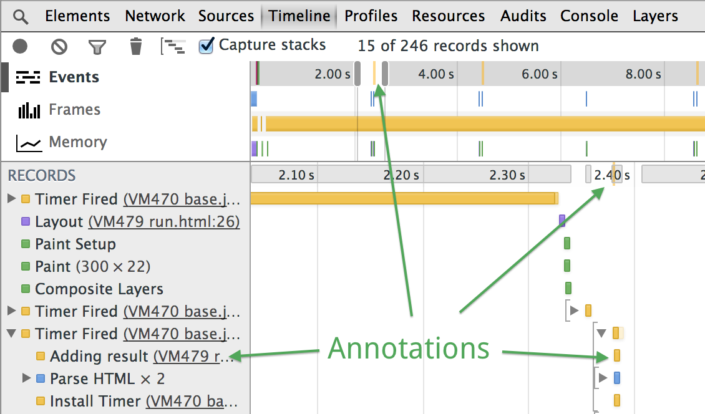
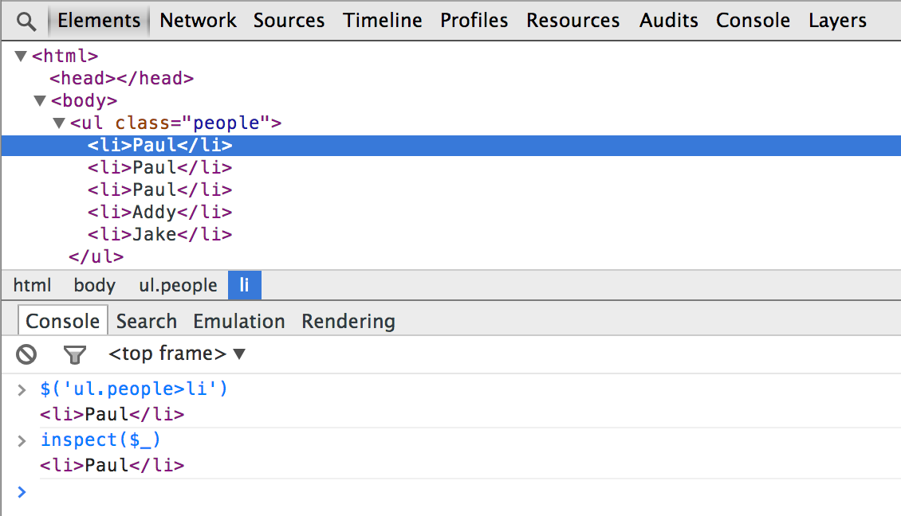
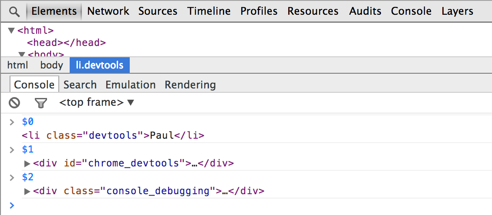
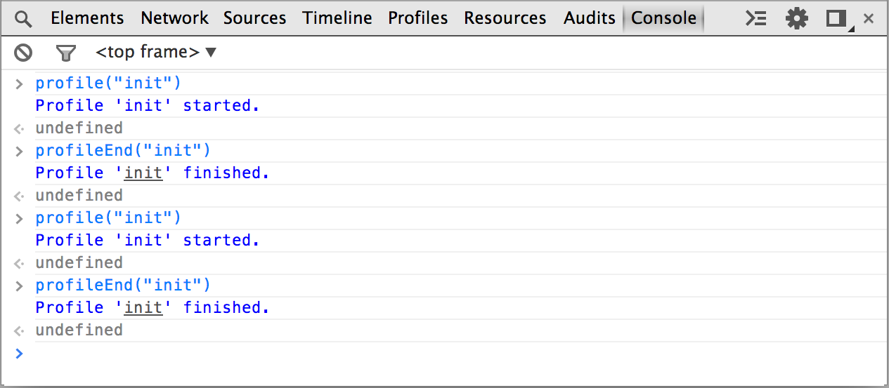
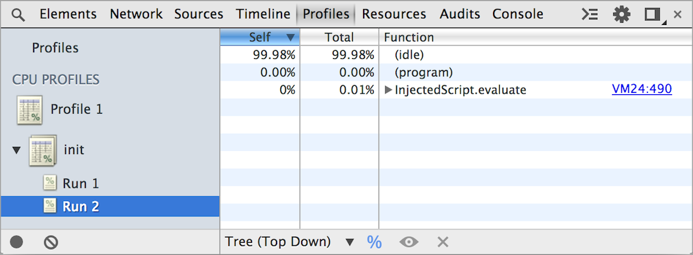

{{+bindTo:partials.standard_devtools_article}}

# <!--@Using the Console-->使用控制台

<!--@The JavaScript Console provides two primary functions for developers  testing web pages and applications:-->
JavaScript 控制台为测试网页和应用的开发者提供了两项主要功能：

* <!--@A place to log diagnostic information using methods provided by the -->
使用[<!--@Console-->控制台 API](console-api.md)<!--@, such as--> 提供的
方法，例如 
[console.log()](console-api.md#consolelogobject-object)<!--@, or--> 或 
[console.profile()](console-api.md#consoleprofilelabel)<!--@.--> 
记录诊断信息。
* <!--@A shell prompt where you can enter commands and interact with the document and the Chrome DevTools. You can evaluate expressions directly in the Console, and can also use the methods provided by the -->
命令提示符，在其中您可以键入命令与文档和 Chrome 开发者工具交互。
您可以直接在控制台中为表达式求值，还可以使用
[<!--@Command Line-->命令行 API](commandline-api.md)<!--@, such as-->，
例如 [$()](commandline-api.md#selector) <!--@command for selecting elements, or-->
命令选择元素或 [profile()](commandline-api.md#profilename) <!--@to start the CPU profiler.-->
启动 CPU 性能分析器。

<!--@This documentation provides an overview and common uses of these two APIs. You can also browse the [Console API](console-api.md) and [Command Line API](commandline-api.md) reference guides.-->
该文档提供这两种 API 的概述和常用方式，您也可以浏览
[控制台 API](console-api.md) 和 [命令行 API](commandline-api.md) 参考指南。

## <!--@Basic operation-->基本操作

### <!--@Opening the Console-->打开控制台

<!--@The JavaScript Console is available in two modes within Chrome DevTools: the primary Console tab, or as a split-view you can display while on another tab (such as Elements or Sources).-->
在 Chrome 开发者工具中，JavaScript 控制台可以在两种模式下使用：
单独的 Console（控制台）标签页，
或者在其他标签页（例如 Elements（元素）或 Sources（源代码））中显示为
分割视图。

<!--@To open the Console tab, do one of the following:-->
要想打开控制台标签页，您可以使用以下任意一种方式：

* <!--@Use the keyboard shortcut-->使用键盘快捷键 **Command - Option - J**
<!--@(Mac) or-->（Mac）或 **Control -Shift -J**<!--@ (Windows/Linux).-->
（Windows/Linux）。
* <!--@Select **View > Developer > JavaScript Console**.-->
选择**Chrome 菜单 > 工具 > JavaScript 控制台**。
<!--#原文中可能为 Mac 系统中的菜单？-->

<!--@To toggle a split-view of the Console on another tab, press the **Esc** key on your keyboard, or click the **Show/Hide Console** button in the bottom left corner of the Chrome DevTools window. In the following screenshot the Console split-view is shown with the Elements panel.-->
如果要在其他标签页上打开或关闭控制台的分割视图，请按 **Esc** 键，
或单击 Chrome 开发者工具窗口右上角的 **Show/Hide Console**
（显示/隐藏控制台）按钮。下列屏幕截图中，控制台分割视图与 Elements（元素）
面板一起显示。
<!--#原文中为左下角，可能为旧版开发者工具界面中按钮所在位置。-->

### <!--@Clearing the console history-->清除控制台历史记录

<!--@To clear the console's history, do one of the following:-->
要清除控制台历史记录，您可以使用以下任意一种方式：

* <!--@Right-click or Ctrl-click anywhere in the Console and choose **Clear Console** from the context menu that appears.-->
右键单击控制台任意位置，并在出现的右键菜单中选择 **Clear Console**
（清除控制台）。
<!--# Ctrl-clicking doesn't seem to work any more.-->
* <!--@Enter the [**clear()**](commandline-api.md#clear) Command Line API at the shell prompt.-->
在命令提示符中输入 [**clear()**](commandline-api.md#clear) 命令行 API。
* <!--@Invoke [**console.clear()**](console-api.md#consoleclear) Console API from JavaScript.-->
从 JavaScript 中调用 [**console.clear()**](console-api.md#consoleclear) 
控制台 API。
* <!--@Use the keyboard shortcut-->使用键盘快捷键 **⌘K** <!--@or-->
或 **⌃L**<!--@ (Mac)-->（Mac）**Control - L**<!--@ (Windows and Linux).-->
（Windows 和 Linux）。

<!--@By default, the console history is cleared when you navigate to another page. You can change this behavior by enabling **Preserve log upon navigation** in the Console area of the Settings dialog (see [Console preferences](#consolepreferences)).-->
默认情况下，当您导航至另一个网页时会清除控制台历史记录。
您可以启用设置对话框（参见[控制台设置](#consolepreferences)）控制台部分
的 **Preserve log upon navigation**（导航时保留日志）改变这样的行为。

### <!--@Console settings-->控制台设置

<!--@The Console has two global settings you can modify in the General tab of the DevTools Settings dialog:-->
在开发者工具设置对话框的 General（常用）标签页中，
有两项控制台的全局设置可以供您修改：

* **Log XMLHTTPRequests**（记录 XMLHttpRequest 请求）&mdash;
<!--@determines if each XMLHTTPRequest is logged to the Console panel.-->
是否将每一次 XMLHttpRequest 请求记录在控制台面板中。
* **Preserve log upon navigation**（导航时保留日志）&mdash;
<!--@determines if console history for the current page is preserved when you navigate to another page. By default, both of these settings are disabled.-->
当您导航至另一个网页时，是否保留当前网页的控制台历史记录。
默认情况下这两项设置都是禁用的。

<!--@You can also change these settings by right-clicking anywhere in the Console to bring up the context menu.-->
您还可以右键单击控制台中任意位置，在弹出的右键菜单中修改这些设置。

## <!--@Using the Console API-->使用控制台 API

<!--@The Console API is collection of methods provided by the global `console` object defined by DevTools. One of the API's main purposes is to [log information](#writing-to-the-console) (such as a property value, or an entire objects or DOM element) to the console while your application is running. You can also group output visually in the console to reduce visual clutter.-->
控制台 API 包含一组方法，通过开发者工具定义的 `console` 全局对象提供。
控制台 API 的主要目的之一是在您的应用程序运行时在控制台中
[记录信息](#writing-to-the-console)（如属性值、整个对象或 DOM 元素）。
您还可以在控制台中对输出内容进行分组，减少视觉上的混乱。

### <!--@Writing to the console-->在控制台中写入信息

<!--@The [console.log()](console-api.md#consolelogobject-object) method takes one or more expressions as parameters and writes their current values to the console. For example:-->
[console.log()](console-api.md#consolelogobject-object) 方法接受一个或多个
表达式作为参数，将它们当前的值写入控制台。例如：

    var a = document.createElement('p');
    a.appendChild(document.createTextNode('foo'));
    a.appendChild(document.createTextNode('bar'));
    console.log("Node count: " + a.childNodes.length);

<!--@Instead of concatenating expressions together with the "+" operator (as shown above), you can put each in its own method parameter and they will be joined together in a space-delimited line.-->
除了使用“+”操作符将表达式连接起来（如上所示）以外，您还可以分别将它们作为
单独的方法参数传递，这样它们会连接成一行，以空格隔开。

    console.log("Node count:", a.childNodes.length, "and the current time is:", Date.now());

### <!--@Errors and warnings-->错误和警告

<!--@The -->[`console.error()`](console-api.md#consoleerrorobject-object) <!--@method displays a red icon along with the message text, which is colored red.-->
方法在加红的消息文本旁显示一个红色图标。

    function connectToServer() {
        console.error("Error: %s (%i)", "Server is  not responding",500);
    }
    connectToServer();

<!--@The -->[`console.warn()`](console-api.md#consolewarnobject-object) <!--@method displays a yellow warning icon with the message text.-->
方法在消息文本旁显示一个黄色的警告图标。

    if(a.childNodes.length < 3 ) {
        console.warn('Warning! Too few nodes (%d)', a.childNodes.length);
    }

### <!--@Assertions-->断言

<!--@The -->[`console.assert()`](console-api.md#consoleassertexpression-object) <!--@method conditionally displays an error string (its second parameter) only if its first parameter evaluates to `false`. For instance, in the following example an error message is written to the console only if the number of child nodes belonging to the `list` element is greater than 500.-->
方法调用时，如果第一个参数求值结果为 `false`，则显示错误字符串（第二个参数）。
例如，在下面的例子中，如果 `list` 元素的子节点数目大于 500 就在控制台中写入
错误消息。

    console.assert(list.childNodes.length < 500, "Node count is > 500");

### <!--@Filtering console output-->过滤控制台输出 ###

<!--@You can quickly filter console output by its severity level--errors, warning, or standard log statements--by selecting one of the filter options. Click on the filter funnel (as shown below) and then select which filter you want to use.-->
您可以选择某个过滤选项，根据严重性程度（错误、警告或标准日志语句）快速过滤
控制台输出。单击过滤漏斗（如下所示），并选择您希望使用的过滤器。

<!--@Filter options:-->
过滤器选项：

* **All**（全部）&mdash;<!--@Shows all console output.-->
显示所有控制台输出。
* **Errors**（错误）&mdash;<!--@Only show output from `console.error()`-->
只显示来自 `console.error()` 的输出。
* **Warnings**（警告）&mdash;<!--@Only show output from `console.warn()`-->
只显示来自 `console.warn()` 的输出。
* **Logs**（日志）&mdash;<!--@Only show output from `console.log()`, `console.info()` and `console.debug()`.-->
只显示来自 `console.log()`、`console.info()` 以及 `console.debug()` 的输出。
* **Debug**（调试）&mdash;<!--@Only show output from `console.timeEnd()` and other console output.-->
只显示来自 `console.timeEnd()` 的输出及其他控制台输出。

### <!--@Grouping output-->分组输出

<!--@You can visually group related console output statements together in the console with the [`console.group()`](console-api.md#consolegroupobject-object) and [`groupEnd()`](console-api.md#consolegroupend) commands.-->
您可以使用 [`console.group()`](console-api.md#consolegroupobject-object) 和 
[`groupEnd()`](console-api.md#consolegroupend) 命令将相关的控制台输出语句
组合在一起。

<pre class ="prettyprint">
    var user = "jsmith", authenticated = false;
    console.group("Authentication phase");
    console.log("Authenticating user '%s'", user);
    // authentication code here...
    if (!authenticated) {
        console.log("User '%s' not authenticated.", user)
    }
    console.groupEnd();
</pre>

<!--@You can also nest logging groups. In the following example a logging group is created for the authentication phase of a login process. If the user is authenticated, a nested group is created for the authorization phase.-->
您还可以嵌套日志分组。在如下例子中，登录过程的认证阶段创建了一个日志分组，
如果用户已经认证，授权阶段又创建了一个嵌套分组。

    var user = "jsmith", authenticated = true, authorized = true;
    // Top-level group
    console.group("Authenticating user '%s'", user);
    if (authenticated) {
        console.log("User '%s' was authenticated", user);
        // Start nested group
        console.group("Authorizing user '%s'", user);
        if (authorized) {
            console.log("User '%s' was authorized.", user);
        }
        // End nested group
        console.groupEnd();
    }
    // End top-level group
    console.groupEnd();
    console.log("A group-less log trace.");

<!--@To create a group that is initially collapsed, use [`console.groupCollapsed()`](console-api.md#consolegroupcollapsed) instead of `console.group()`, as shown below:-->
如果要创建一个初始状态下折叠的分组，
请用 [`console.groupCollapsed()`](console-api.md#consolegroupcollapsed) 代替
 `console.group()`，如下所示：

    console.groupCollapsed("Authenticating user '%s'", user);
    if (authenticated) {
      ...
    }

### <!--@String substitution and formatting-->字符串替换与格式化

<!--@The first parameter you pass to any of the console's logging methods (`log()` or `error()`, for example) may contain one or more _format specifiers_. A format specifier consists of a **`%`** symbol followed by a letter that indicates the formatting that should be applied to the inserted value (`%s` for strings, for example). The format specifier identifies where to substitute a value provided by a subsequent parameter value.-->
任何控制台日志方法（例如 `log()` 或 `error()`）的第一个参数都能包含
一个或多个*格式化符号*。格式化符号由 **`%`** 加上一个字母构成，表示应用于
插入值的格式（例如字符串则为 `%s`)。格式化符号指明在什么位置替换由
后续参数提供的值。

<!--@The following example using the `%s` (string) and `%d` (integer) formatters to insert values into the output string.-->
如下例子使用 `%s`（字符串）和 `%d`（整型）格式化符号在输出字符串中插入值。

    console.log("%s has %d points", "Sam", "100");

<!--@This would result in "Sam has 100 points" being logged to the console.-->
调用后在控制台中写入 "Sam has 100 points"。

<!--@The following table lists the supported format specifiers and the formatting they apply:-->
下表列出了支持的格式化符号以及应用的格式：

|<!--@Format specifier-->格式化符号|<!--@Description-->描述
-----------------|---------------
`%s` | <!--@Formats the value as a string.-->以字符串表示值。
`%d` <!--@or-->或 `%i` | <!--@Formats the value as an integer.-->以整数表示值。
`%f` | <!--@Formats the object as a floating point value.-->以浮点数表示对象。
`%o` |  <!--@Formats the value as an expandable DOM element (as in the Elements panel).-->以可展开的 DOM 元素（和元素面板中一致）表示值。
`%O` | <!--@Formats the value as an expandable JavaScript object.-->以可展开的 JavaScript 对象表示值。
`%c` | <!--@Applies CSS style rules to output string specified by the second parameter.-->在输出的字符串上使用第二个参数指定的 CSS 样式规则。

<!--@In the following example the `%d` format specifier is substituted with the value of `document.childNodes.length` and formatted as an integer; the `%f` format specifier is substituted with the value returned by `Date.now()`, which is formatted as a floating point number.-->
在下面的例子中，`%d` 格式化符号替换为 `document.childNodes.length`，并以整型
表示，`%f` 格式化符号替换为 `Date.now()` 返回的值，并以浮点数表示。

    console.log("Node count: %d, and the time is %f.", document.childNodes.length, Date.now());

### <!--@Formatting DOM elements as JavaScript objects-->以 JavaScript 对象的形式表示 DOM 元素

<!--@By default, when you log a DOM element to the console it's displayed in an XML format, as in the Elements panel:-->
默认情况下，当您在控制台中记录 DOM 元素时它会显示为 XML 格式，
与 Elements（元素）面板中一致：

    console.log(document.body.firstElementChild)

<!--@You can also log an element's JavaScript representation with the `console.dir()` method:-->
您可以使用 `console.dir()` 方法记录元素的 JavaScript 表达：

    console.dir(document.body.firstElementChild);

<!--@Equivalently, you can us the `%O` [format specifier](#string-substitution-and-formatting) with `console.log()`:-->
您也可以在 `console.log()` 中使用与之等价
的 `%O` [格式化符号](#string-substitution-and-formatting)：

    console.log("%O", document.body.firstElementChild);

### <!--@Styling console output with CSS-->使用 CSS 修改控制台输出的样式 ###

<!--@You use the `%c` format specifier to apply custom CSS rules to any string you write to the Console with [`console.log()`](#writingtotheconsole) or related methods.-->
您可以使用 `%c` 格式化符号将自定义的 CSS 规则应用于您
通过 [`console.log()`](#writingtotheconsole) 或相关方法写入控制台的
任意字符串。

    console.log("%cThis will be formatted with large, blue text", "color: blue; font-size: x-large");

### <!--@Measuring how long something takes-->测量某个操作花费的时间

<!--@You can use the [`console.time()`](console-api.md#consoletimelabel) and [`console.timeEnd()`](console-api.md#consoletimeendlabel) methods to measure how long a function or operation in your code takes to complete. You call `console.time()` at the point in your code where you want to start the timer and `console.timeEnd()` to stop the timer. The elapsed time between these two calls is displayed in the console.-->
您可以使用 [`console.time()`](console-api.md#consoletimelabel) 和 
[`console.timeEnd()`](console-api.md#consoletimeendlabel) 方法
测量您代码中某个函数或操作需要多少时间完成。您应该在代码中开始计时的位置
调用 `console.time()`，结束计时的位置调用 `console.timeEnd()`。这两个调用
之间经过的时间会显示在控制台中。

    console.time("Array initialize");
    var array= new Array(1000000);
    for (var i = array.length - 1; i >= 0; i--) {
        array[i] = new Object();
    };
    console.timeEnd("Array initialize");

<!--@Note: You must pass the same string to `console.time()` and `timeEnd()` for the timer to finish as expected.-->
注：您必须向 `console.time()` 和 `timeEnd()` 传递相同的字符串才能使定时器
正常结束。

### <!--@Marking the Timeline-->标记时间线

<!--@The [Timeline panel](timeline.md) gives you a complete overview of where time is spent when loading and using your web app or page. The [`console.timeStamp()`](console-api.md#consoletimestamplabel) method marks the Timeline at the moment it was executed. This provides an easy way to correlate events in your application with other browser-related events, such as layout or paints.-->
[Timeline（时间线）面板](timeline.md)为您提供加载和使用您的网上应用或网页时
如何花费时间的完整概述。
[`console.timeStamp()`](console-api.md#consoletimestamplabel) 方法在执行时
所处的时刻标记时间线，这样您就能很容易地将应用程序中的事件与其他浏览器相关
的事件，如布局或绘图联系起来。

<!--@Note: The `console.timeStamp()` method only functions while a Timeline recording is in progress.-->
注：只有当时间线记录进行时 `console.timeStamp()` 方法才能正常工作。

<!--@In the following example the Timeline is marked when the application enters the `AddResult()` function's implementation.-->
如下例子中，应用程序进入 `AddResult()` 函数实现时标记时间线：

    function AddResult(name, result) {
      console.timeStamp("Adding result");
      var text = name + ': ' + result;
      var results = document.getElementById("results");
      results.innerHTML += (text + " ");
    }

<!--@As shown in the following screenshot, the `timeStamp()` command annotates the Timeline in the following places:-->
如下屏幕截图所示，`timeStamp()` 命令在以下几处为时间线添加注解：

*  <!--@A yellow vertical line in the Timeline's summary and detail views.-->
时间线概述和详情视图中的黄色竖线。
*  <!--@A record is added to the list of recorded events.-->
已记录事件列表中添加一条记录。

### <!--@Setting breakpoints in JavaScript-->在 JavaScript 中设置断点 ###

<!--@You can start a debugging session from your JavaScript code by calling the [`debugger`](console-api.md#debugger) command. For instance, in the following example the JavaScript debugger is opened when an object's `brightness()` function is invoked:-->
您可以在 JavaScript 代码中调用 [`debugger`](console-api.md#debugger) 命令
开始调试会话。例如，在下面的例子中调用对象的 `brightness()` 函数时
打开 JavaScript 调试器。

    brightness : function() {
        debugger;
        var r = Math.floor(this.red*255);
        var g = Math.floor(this.green*255);
        var b = Math.floor(this.blue*255);
        return (r * 77 + g * 150 + b * 29) >> 8;
    }

<aside class="note">
<!--@An interesting technique of using conditional breakpoints was explored by Brian Arnold in <a href="http://www.randomthink.net/blog/2012/11/breakpoint-actions-in-javascript/">Breakpoint Actions in JavaScript</a>.-->
Brian Arnold 的 
<a href="http://www.randomthink.net/blog/2012/11/breakpoint-actions-in-javascript/">Breakpoint Actions in JavaScript</a> 
中探索出了一种使用条件断点的有趣技术。
</aside>

## <!--@Using the Command Line API-->使用命令行 API

<!--@In addition to being a place where you can log information from your application, the Console is also a shell prompt where you can directly evaluate expressions or issue commands provided by the [Command Line API](commandline-api.md). This API provides the following features:-->
控制台不仅仅是您的应用程序记录信息的场所，同时还是命令提示符，
您可以直接在其中计算表达式的值或使用[命令行 API](commandline-api.md) 提供的命令。
命令行 API 提供如下功能：

* <!--@Convenience functions for selecting DOM elements-->
方便选择 DOM 元素的函数
* <!--@Methods for controlling the CPU profiler-->
控制 CPU 性能分析器的方法
* <!--@Aliases for a number of Console API methods-->
一些控制台 API 方法的别名
* <!--@Monitoring events-->
监控事件
* <!--@View event listeners registered on objects-->
查看对象上注册的事件监听器

### <!--@Evaluating expressions-->计算表达式的值 ###

<!--@The Console attempts to evaluate any JavaScript expression you enter at the shell prompt, upon pressing the Return or Enter key. The Console provides auto-completion and tab-completion. As you type expressions, property names are automatically suggested. If there are multiple properties with the same prefix, pressing the Tab key cycles through them. Pressing the right arrow key accepts the current suggestion. The current suggestion is also accepted by pressing the Tab key if there is only one matched property.-->
您在命令提示符中输入 JavaScript 表达式并按回车键后，控制台会尝试计算它的值。
控制台提供了自动完成和 Tab 键完成的功能，您输入表达式的过程中会自动显示
属性名称的建议。如果有多个相同前缀的属性，您可以使用 Tab 键在其中选择。
按下右箭头接受当前建议，如果只有一个匹配的属性则按下 Tab 键也会接受建议。

<!--@To enter a multi-line expression at the shell prompt (such as a function definition) press Shift+Enter between lines.-->
如果需要在命令提示符中输入多行表达式（例如函数定义），
请在行与行之间按下 Shift+Enter。

### <!--@Selecting elements-->选择元素

<!--@The Command Line API provides several methods to access DOM elements in your application. For example, the [**`$()`**](commandline-api.md#selector) method returns the first element that matches the specified CSS selector, just like [`document.querySelector()`](http://docs.webplatform.org/wiki/css/selectors_api/querySelector). For instance, the following code returns the element with the ID "loginBtn".-->
命令行 API 提供了多种方法访问您的应用程序中的 DOM 元素。例如，
[**`$()`**](commandline-api.md#selector) 方法返回匹配指定 CSS 选择器的
第一个元素，就像 
[`document.querySelector()`](http://docs.webplatform.org/wiki/css/selectors_api/querySelector) 
一样。例如，下面的代码返回 ID 为“loginBtn”的元素。

    $('#loginBtn');

<!--@The [**`$$()`**](commandline-api.md#selector-1) command returns an array of all the elements that match the specified CSS selector, just like [`document.querySelectorAll()`](http://docs.webplatform.org/wiki/css/selectors_api/querySelectorAll). For instance, the following displays selects all `<button>` elements with the CSS class "loginBtn":-->
[**`$$()`**](commandline-api.md#selector-1) 命令返回匹配指定 CSS 选择器的
所有元素组成的数组，就像 
[`document.querySelectorAll()`](http://docs.webplatform.org/wiki/css/selectors_api/querySelectorAll) 
一样。例如，下面的代码选择 CSS 类为“loginBtn”的所有 `<button>` 元素。

    $$('button.loginBtn');

<!--@Lastly, the [`x()`](commandline-api.md#xpath) method takes an XPath path as a parameter and returns an array of all elements that match the specified path. The following returns all the &lt;script> elements that are children of the `<body>` tag:-->
最后，[`x()`](commandline-api.md#xpath) 方法接受 XPath 参数，返回
匹配指定路径的所有元素组成的数组。如下代码返回所有 `<body>` 标签下
的 &lt;script> 子元素。

    $x('/html/body/script');

### <!--@Inspecting DOM elements and JavaScript heap objects-->审查 DOM 元素与 JavaScript 堆对象

<!--@The [`inspect()`](commandline-api.md#inspectobject) method takes a DOM element reference (or JavaScript reference) as a parameter and displays the element or object in the appropriate panel&mdash;the Elements panel for DOM elements, or the Profile panel for a JavaScript object.-->
[`inspect()`](commandline-api.md#inspectobject) 方法接受 DOM 引用
（或 JavaScript 引用）作为参数，在合适的面板中显示元素或对象——
Elements（元素）面板中显示 DOM 元素，
Profiles（性能分析）面板中显示 JavaScript 对象。

<!--@For example, in the following screenshot the `$()` function is used to get a reference to an `<li>` element. Then the last evaluated expression property ([`$_`](commandline-api.md#_)) is passed to `inspect()` to open that element in the Elements panel.-->
例如，如下屏幕截图中使用 `$()` 函数获取 `<li>` 元素的引用，然后最后求值的
表达式结果（[`$_`](commandline-api.md#_)）传递给 `inspect()`，
在 Elements（元素）面板中打开指定元素。

### <!--@Accessing recently selected elements and objects-->访问最近选择的元素和对象

<!--@Often when testing you'll select DOM elements&mdash;either directly in the Elements panel or using the Selection tool (magnifying glass)&mdash;so that you can further inspect the element. Or, when analyzing a memory snapshot in the Profiles panel, you might select a JavaScript object to further inspect it.-->
通常在测试时，您会选择 DOM 元素（无论是直接在 Elements（元素）面板中还是使用
选择工具（放大镜））以便进一步审查元素。
或者在 Profiles（性能分析）面板中分析内存快照时，您可能会选择
某个 JavaScript 对象进一步审查它。

<!--@The Console remembers the last five elements (or heap objects) you've selected and makes them available as properties named [**`$0`**, **`$1`**, **`$2`**, **`$3`**](commandline-api.md#0-4) and [**`$4`**](commandline-api.md#0-4). The most recently selected element or object is available as **`$0`**, the second most as **`$1`**, and so forth.-->
控制台会记录您选择的最后五个元素（或堆对象），您可以通过名为 [**`$0`**、
**`$1`**、**`$2`**、**`$3`**、**`$4`**](commandline-api.md#0-4) 的属性
访问它们。最近选择的元素或对象可以通过 **`$0`** 访问，第二个通过 **`$1`**，
依次类推。

<!--@The following screenshot shows the values of these properties after selecting three different elements in turn from the Elements panel:-->
以下屏幕截图显示 Elements（元素）面板中依次选择三个不同元素后这些属性的值：

<!--@Note: You can also Right-click or Control-click on any element in the Console and select **Reveal in Elements Panel**.-->
注：您还可以右键单击控制台中的任意元素，并选择 **Reveal in Elements Panel**
（在元素面板中显示）。

### <!--@Monitoring events-->监控事件

<!--@The [`monitorEvents()`](commandline-api.md#monitoreventsobject-events) command monitors an object for one or more specified events. When an event occurs on the monitored object, the corresponding Event object is logged to the Console. You specify the object and the events you want to monitor on that object. For example, the following code enables event monitoring for every "resize" event on the global window object.-->
[`monitorEvents()`](commandline-api.md#monitoreventsobject-events) 命令
监控某个对象上的一个或多个事件。监控的对象上发生某个事件时，
对应的 Event 对象就会记录在控制台中。您需要指定要监控的对象及事件，例如，
如下代码在全局 window 对象上为所有 "resize" 事件启用事件监控。

    monitorEvents(window, "resize");

<!--@To monitor several events, you can pass an array of event names as the second parameter. The code below monitors both "mousedown" and "mouseup" events on the body of the document.-->
如果要监控多个事件，您可以在第二个参数中传递事件名称的数组。下面的代码监控
文档中 body 元素的 "mousedown" 和 "mouseup" 事件。

    monitorEvents(document.body, ["mousedown", "mouseup"]);

<!--@You can also pass one of the supported "event types" that DevTools maps to a set of actual event names. For example, the "touch" event type cause DevTools to monitor "touchstart", "touchend", "touchmove", and "touchcancel" events on the target object.-->
您还可以传递支持的“事件类型”，开发者工具会将它映射为一系列事件名称。
例如，"touch" 事件类型使开发者工具监控目标对象上的 "touchstart"、
"touchend"、"touchmove" 和 "touchcancel" 事件。

    monitorEvents($('#scrollBar'), "touch");

<!--@See [`monitorEvents()`](commandline-api.md#monitoreventsobject-events) in the Console API Reference for a list of supported event types.-->
有关支持的事件类型，请参见控制台 API 参考中的 
[`monitorEvents()`](commandline-api.md#monitoreventsobject-events)。

<!--@To stop monitoring events call `unmonitorEvents()`, passing the object to stop monitoring.-->
如果要停止监控事件，请调用 `unmonitorEvents()`，传递要停止监控的对象。

    unmonitorEvents(window);

### <!--@Controlling the CPU profiler-->控制 CPU 性能分析器

<!--@You can create JavaScript CPU profiles from the command line with the [`profile()`](commandline-api.md#profilename) and [`profileEnd()`](commandline-api.md#profileendname) commands. You can optionally specify a name that's applied to the profile you create.-->
您可以在命令行中使用 [`profile()`](commandline-api.md#profilename) 和 
[`profileEnd()`](commandline-api.md#profileendname) 命令创建 JavaScript CPU 
性能分析报告。您可以指定可选的名称，应用于您创建的性能分析报告。

<!--@For example, the following shows an example of creating a new profile with the default name:-->
例如，以下例子创建新的性能分析报告，使用默认名称：

<!--@The new profile appears in the Profiles panel under the name "Profile 1":-->
新的性能分析报告在 Profiles（性能分析）面板中显示，名称为“Profile 1”：

<!--@If you specify a label for the new profile, it is used as the new profile's heading. If you create multiple profiles with the same name, they are grouped as individual runs under the same heading:-->
如果您为新的性能分析报告指定了名称，它将用作新的性能分析报告的标题。
如果您创建了多个具有相同名称的性能分析报告，
它们会在同一标题下组合为单独的运行结果：

<!--@The result in the Profiles panel:-->
Profiles（性能分析）面板中结果如下：

<!--@CPU profiles can be nested, for example:-->
CPU 性能分析还可以嵌套，例如：

    profile("A");
    profile("B");
    profileEnd("B")
    profileEnd("A")

<!--@The calls to stop and start profiling do not need be properly nested. For example, the following works the same as the previous example:-->
停止和开始性能分析的调用不一定要正确嵌套，例如下列代码与之前的例子等效：

    profile("A");
    profile("B");
    profileEnd("A");
    profileEnd("B");

{{/partials.standard_devtools_article}}
