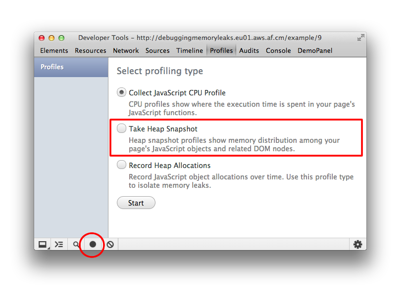
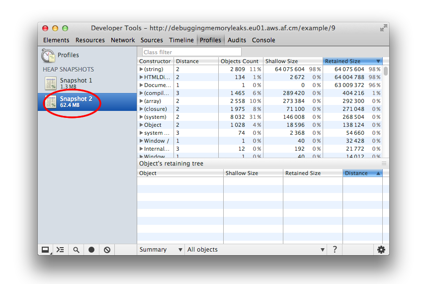
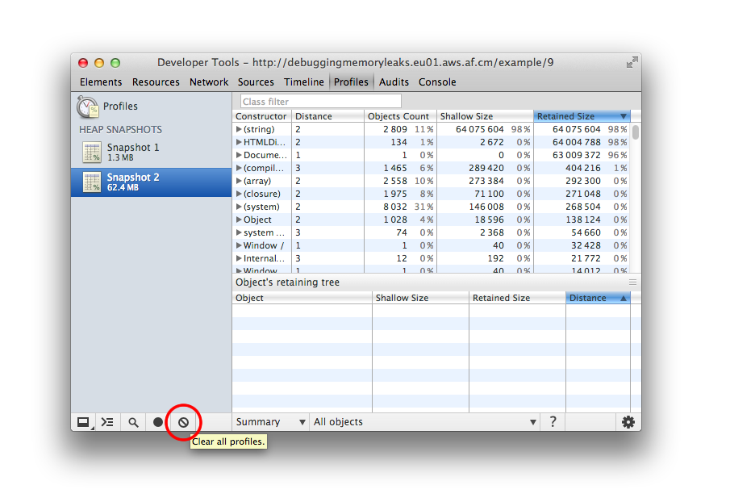
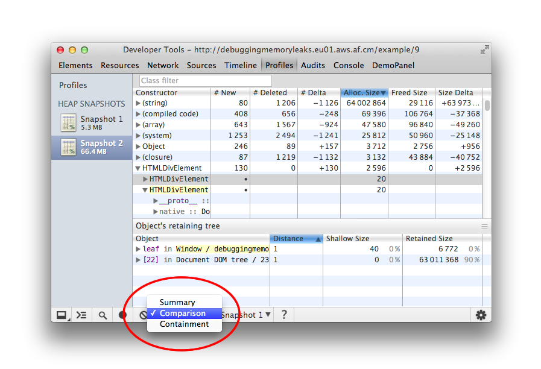
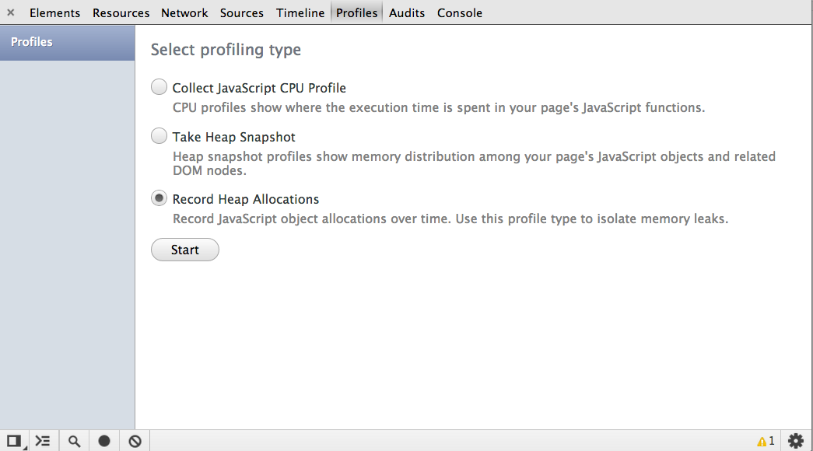
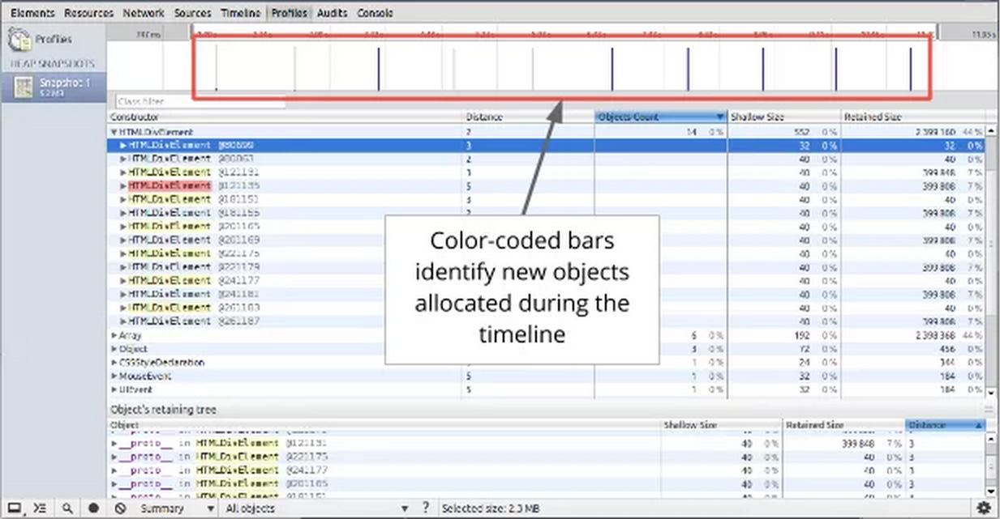
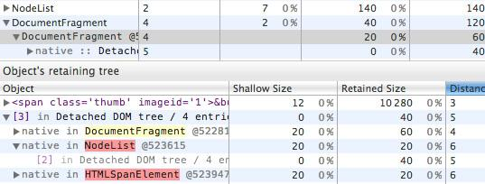
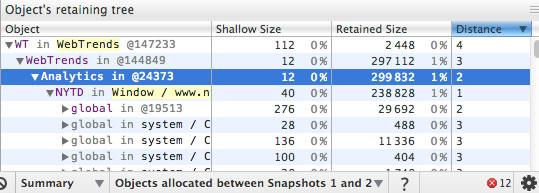

{{+bindTo:partials.standard_devtools_article}}

# JavaScript <!--@Memory Profiling-->内存性能分析

<!--@A **memory leak** is a gradual loss of available computer memory. It occurs when a program repeatedly fails to return memory it has obtained for temporary use. JavaScript web apps can often suffer from similar memory related issues that native applications do, such as **leaks** and bloat but they also have to deal with **garbage collection pauses.**-->
**内存泄漏**是计算机可用内存逐渐减少的过程，当程序不能释放为了临时使用而
获取的内存时就会发生内存泄漏。JavaScript 网上应用与原生应用程序类似，
也会遇到类似的与内存相关的问题，例如**泄漏**和膨胀，另外还需要考虑
**垃圾回收暂停**的问题。

<!--@Although JavaScript uses garbage collection for automatic memory management, [effective](http://www.html5rocks.com/en/tutorials/memory/effectivemanagement/) memory management is still important. In this guide we will walk through profiling memory issues in JavaScript web apps. Be sure to try the [supporting demos](#supporting-demos) when learning about features to improve your awareness of how the tools work in practice.-->
尽管 JavaScript 通过垃圾回收机制自动进行内存管理，
[有效的](http://www.html5rocks.com/en/tutorials/memory/effectivemanagement/)
内存管理依然是很重要的。在这篇指南中，我们将讨论如何分析 JavaScript 网上应用
的内存问题。学习相关特性时请务必尝试[案例演示](#supporting-demos)，以便
更好地了解在实际应用中这些工具如何工作。

<!--@Read
the <a href="memory-analysis-101.html">Memory 101</a> page to become
familiar with the terms used in this document.-->
要想熟悉该文档中使用的术语，请阅读<a 
href="memory-analysis-101.html">内存 101</a>。

<strong><!--@Note:-->注：</strong><!--@ Some of these features we will be using are currently only available in <a href="http://www.google.com/intl/en/chrome/browser/canary.html">Chrome Canary</a>. We recommend using this version to get the best memory profiling tooling for your applications.-->
以下某些特性目前
仅在 <a href="https://www.google.com/intl/en/chrome/browser/canary.html">Chrome Canary</a> 中
可用，我们建议您使用这一版本为您的应用程序获取最好的内存性能分析工具。

## <!--@Questions to ask yourself-->需要回答的问题

<!--@In general, there are three questions you will want to answer when you think you have a memory leak:-->
大体上说，当您觉得有内存泄漏时，您需要回答三个问题：

* **<!--@Is my page using too much memory?-->我的网页是不是占用了太多内存？**<!--@ - the [Timeline memory view](#memory_mode) and [Chrome task manager](#chrome_task_manager) can help you identify if you’re using too much memory. Memory view can track the number of live DOM nodes, documents and JS event listeners in the inspected render process. As a rule of thumb: avoid holding references to DOM elements you no longer need to use, unbind unneeded event listeners and take care when storing large chunks of date you aren't going to use.-->
——[时间线的内存视图](#timeline-memory-view)
和 [Chrome 任务管理器](#chrome-task-manager)可以帮您识别是否占用了太多内存。
内存视图可以跟踪审查的渲染进程中活动的 DOM 节点、文档以及 JS 事件监听器。
一条重要准则是：避免持有您不再使用的 DOM 元素引用，
取消绑定不需要的事件监听器，注意不再使用的大块数据是否仍然存储着。

* **<!--@Is my page free of memory leaks?-->我的网页有没有内存泄漏？**<!--@ - the [Object allocation tracker](#object_allocation_tracker) can help you narrow down leaks by looking at JS object allocation in real-time. You can also use the [heap profiler](#heap_profiler) to take JS heap snapshots, analyze memory graphs and compare snapshots to discover what objects are not being cleaned up by garbage collection.-->
——[对象分配跟踪器](#object-allocation-tracker)可以让您实时查看 JS 对象的
分配，以便找出内存泄漏。您还可以使用[堆性能分析器](#heap-profiler)
抓取 JS 堆快照，分析内存图象，比较快照以便找出没有被垃圾回收机制清理的对象。

* **<!--@How frequently is my page forcing garbage collection?-->我的网页强制进行垃圾回收的次数是否过于频繁？**<!--@ - if you are GCing frequently, you may be allocating too frequently. The [Timeline memory view](#identifying_a_memory_problem_with_the_devtools_timeline) can help you identify pauses of interest.-->
——如果您的网页经常发生垃圾回收，可能是因为您分配得太频繁了。
[时间线的内存视图](#timeline-memory-view)可以帮您识别与之对应的执行暂停。

<!--@**Table of contents**

-->

## <!--@Terminology and Fundamentals-->术语和基础知识

<!--@This section describes common terms used in **memory analysis**, and is applicable to a variety of memory profiling tools for different languages. The terms and notions described here are used in the Heap Profiler UI and the corresponding documentation.-->
这一部分描述**内存分析**中常用的术语，它们适用于不同语言的各种内存性能
分析工具。这里描述的术语和记号在堆性能分析器用户界面和对应的文档中广泛使用。

<!--@It helps to become familiar with these to use the tool effectively. If you have ever worked with either the Java, .NET, or some other memory profiler then this may be a refresher.-->
这一部分可以帮您熟悉这些术语以便有效地使用工具。如果您曾经使用过 Java、
.NET 或其他一些内存性能分析工具，这一部分可以帮助您回顾这些知识。

### <!--@Object sizes-->对象大小

<!--@Think of memory as a graph with primitive types (like numbers and strings) and objects (associative arrays). It might visually be represented as a graph with a number of interconnected points as follows:-->
将内存想象成基本类型（如数值和字符串）和对象（关联数组）组成的图，可以形象地
表示成如下所示相互连接的点构成的图：

<!--@An object can hold memory in two ways:-->
一个对象可以以两种方式占用内存：

* <!--@Directly by the object itself-->
直接由对象本身占用。

* <!--@Implicitly by holding references to other objects, and therefore preventing those objects from being automatically disposed by a garbage collector (**GC** for short).-->
隐式持有其他对象的引用，避免这些对象被垃圾回收机制（简称 **GC**）自动释放。

<!--@When working with the Heap Profiler in DevTools (a tool for investigating memory issues found under "Profiles"), you will likely find yourself looking at a few different columns of information. Two that stand out are <strong>Shallow Size</strong> and <strong>Retained Size</strong>, but what do these represent?-->
使用开发者工具中的堆性能分析器（Profiles（性能分析）中分析内存问题的工具）时，
您可能会查看各种不同信息，其中突出的两类是 <strong>Shallow Size</strong>
（浅大小）和 <strong>Retained Size</strong>（持有大小），它们是什么意思？

#### <!--@Shallow size-->浅大小（Shallow size）

<!--@This is the size of memory that is held by the object itself.-->
即对象本身在内存中占用的大小。

<!--@Typical JavaScript objects have some memory reserved for their description and for storing immediate values. Usually, only arrays and strings can have a significant shallow size. However, strings and external arrays often have their main storage in renderer memory, exposing only a small wrapper object on the JavaScript heap.-->
通常 JavaScript 对象保留了一些内存，用于存储它们的描述还有中间值。
一般情况下，只有数组和字符串的浅大小比较显著。
但是，字符串和外部数组的主要存储区常常在渲染器内存中，在 JavaScript 堆中
只有一些微小的外覆对象。

<!--@Renderer memory is all memory of the process where an inspected page is rendered: native memory + JS heap memory of the page + JS heap memory of all dedicated workers started by the page. Nevertheless, even a small object can hold a large amount of memory indirectly, by preventing other objects from being disposed of by the automatic garbage collection process.-->
渲染器内存是渲染审查网页的进程占用的所有内存：原生内存 + 网页的 JS 堆内存 + 
网页启动的专有工作线程占用的 JS 堆内存。尽管如此，即使是一个很小的对象也能
间接占用大量内存，避免其他对象被自动的垃圾回收过程释放。

#### <!--@Retained size-->持有大小（Retained size）

<!--@This is the size of memory that is freed once the object itself is deleted along with its dependent objects that were made unreachable from **GC roots**.-->
即对象本身释放后，连同之后无法从 **GC 根对象**访问依赖对象而释放的内存大小。

<!--@**GC roots** are made up of *handles* that are created (either local or global) when making a reference from native code to a JavaScript object outside of V8. All such handles can be found within a heap snapshot under **GC roots** > **Handle scope** and **GC roots** > **Global handles**. Describing the handles in this documentation without diving into details of the browser implementation may be confusing. Both GC roots and the handles are not something you need to worry about.-->
在 V8 之外从原生代码中引用 JavaScript 对象时，创建的**句柄**
（无论是局部的还是全局的）构成 **GC 根对象**。所有这样的句柄都可以在堆快照中
 **GC roots** > **Handle scope** 和 **GC roots** > **Global handles** 部分
 找到。在该文档中描述这些句柄而不深入浏览器的实现细节可能会令人疑惑，
 但是 GC 根对象和句柄都不是您需要担心的。

<!--@There are lots of internal GC roots most of which are not interesting for the users. From the applications standpoint there are following kinds of roots:-->
许多 GC 根对象对用户来说并不重要，从应用程序的角度来看有以下几类根对象：

* <!--@Window global object (in each iframe). There is a distance field in the heap snapshots which is the number of property references on the shortest retaining path from the window.-->
window 全局对象（在每一个 iframe 中）。堆快照中 Distance（距离）字段
就是对象从 window 开始的最短持有路径上属性引用的数目。

* <!--@Document DOM tree consisting of all native DOM nodes reachable by traversing the document. Not all of them may have JS wrappers but if they have the wrappers will be alive while the document is alive.-->
文档 DOM 树由所有遍历文档时可访问的原生 DOM 节点构成，其中并不是所有节点
都有 JS 外覆，但是如果有的话只要文档还存在它们也仍然存在。

* <!--@Sometimes objects may be retained by debugger context and DevTools console (e.g. after console evaluation).-->
有时候调试器上下文和开发者工具控制台（例如在控制台中求值后）也会持有对象。

<strong><!--@Note:-->注：</strong><!--@ We recommend users to do heap snapshots with clear console and no active breakpoints in the debugger.-->
我们建议用户在控制台为空并且调试器中没有活动断点的状态下采集堆快照。

<!--@The memory graph starts with a root, which may be the `window` object of the browser or the `Global` object of a Node.js module. You don't control how this root object is GC'd.-->
如下内存图从根节点开始，可能是浏览器的 `window` 对象或 Node.js 模块
的 `Global` 对象。您不能控制根对象的垃圾回收。

<!--@Whatever is not reachable from the root gets GC.-->
不能从根对象到达的节点就会进入垃圾回收过程。

<strong><!--@Note:-->注：</strong><!--@ Both the Shallow and Retained size columns represent data in bytes.-->浅大小和持有大小列都以字节
为单位表示数据。

### <!--@Object's Retaining Tree-->对象的持有树

<!--@As we introduced earlier, the heap is a network of interconnected objects. In the mathematical world, this structure is called a *graph* or memory graph. A graph is constructed from *nodes* connected by means of *edges*, both of which are given labels.-->
根据我们前面的介绍，堆是互相连接的对象构成的网络。在数学中，这种结构称为
*图*或内存图。图由*节点*构成，节点之间通过*边*连接。两者都加上了标签。

* <!--@**Nodes** (*or objects*) are labelled using the name of the *constructor *function that was used to build them-->
**节点**（*或对象*）使用建立对象的*构造*函数标注

* <!--@**Edges** are labelled using the names of *properties*.-->
**边**使用*属性*名称标注。

<!--@Later in this guide you will learn how to record a profile using the Heap Profiler. Some of the eye-catching things we can see in the Heap Profiler recording below include distance: the distance from the GC root. If almost all the objects of the same type are at the same distance, and a few are at a bigger distance, that's something worth investigating.-->
在这篇指南后面一部分中，您会学习如何使用堆性能分析器记录性能分析数据。
如下堆性能分析器记录中有一些吸引眼球的内容，包括距离：从 GC 根对象到指定对象的距离。如果同类对象中几乎所有对象距离都相同，很少一部分距离较大，
这就需要进行一些分析了。

### <!--@Dominators-->支配者（Dominators）

<!--@Dominator objects are comprised of a tree structure because each object has exactly one dominator. A dominator of an object may lack direct references to an object it dominates, that is, the dominators tree is not a spanning tree of the graph.-->
支配者对象由树结构组成，每一个对象刚好有一个支配者。对象的支配者不一定直接引用它支配的对象，也就是说支配树不是图的生成树。

<!--@In the diagram above:-->在上图中：

* <!--@Node 1 dominates node 2-->
节点 1 支配节点 2
* <!--@Node 2 dominates nodes 3, 4 and 6-->
节点 2 支配节点 3、4、6
* <!--@Node 3 dominates node 5-->
节点 3 支配节点 5
* <!--@Node 5 dominates node 8-->
节点 5 支配节点 8
* <!--@Node 6 dominates node 7-->
节点 6 支配节点 7

<!--@In the example below, node `#3` is the dominator of `#10`, but `#7` also exists in every simple path from GC to `#10`. Therefore, an object B is a dominator of an object A if B exists in every simple path from the root to the object A.-->
在下面的例子中，节点 `#3` 是 `#10` 的支配者，但是 `#7` 也存在于 GC 到 `#10` 
的每一条简单路径中。所以，如果 B 存在于根对象到对象 A 之间的每一条简单路径中，
对象 B 就是对象 A 的支配者。

### V8 <!--@Specifics-->相关概念

<!--@In this section we describe some memory-related topics that correspond specifically to the **V8 JavaScript virtual machine **(V8 VM or VM). When profiling memory, it is helpful to understand why heap snapshots look this way.-->
在这一部分我们会描述 **V8 JavaScript 虚拟机**（V8 VM 或 VM）特有的
内存相关话题。分析内存性能时，这些内容有助于帮您理解为什么堆快照是您所看到的
那样。

#### JavaScript <!--@Object Representation-->对象的表达方式

<!--@There are three primitive types:-->
有三种基本类型：

* <!--@Numbers (e.g 3.14159..)-->
数值（例如 3.14169..）
* <!--@Booleans (true or false)-->
布尔值（true 或 false）
* <!--@Strings (e.g 'Werner Heisenberg')-->
字符串（例如 'Werner Heisenberg'）

<!--@They cannot reference other values and are always leafs or terminating nodes.-->
它们不能引用其他值，永远是叶节点或终止节点。

<!--@**Numbers** can be stored as either:-->
**数值**可以使用以下某一种方式存储：

* <!--@an immediate 31-bit integer values called **small integers** (*SMIs*), or-->
31 位立即整数值，称为**小整型**（*SMI*）或

* <!--@heap objects, referred to as **heap numbers**. Heap numbers are used for storing values that do not fit into the SMI form, such as *doubles*, or when a value needs to be *boxed*, such as setting properties on it.-->
堆对象，称为**堆数值**。堆数值用于存储 SMI 形式无法表达的值，例如
*双精度浮点数*，或者当数值需要*装箱*时，例如在数值上设置属性。

<!--@**Strings** can be stored in either:-->
**字符串**可以使用以下某一种方式存储：

* <!--@the **VM heap**, or-->
**虚拟机堆**或

* <!--@externally in the **renderer’s memory**. A *wrapper object* is created and used for accessing external storage where, for example, script sources and other content that is received from the Web is stored, rather than copied onto the VM heap.-->
在外部**渲染器内存**中。访问外部存储，例如从网上接收的脚本源代码和其他内容时，
不会将它们复制到虚拟机堆中，而是创建*外覆对象*。

<!--@Memory for new JavaScript objects is allocated from a dedicated JavaScript heap (or **VM heap**).These objects are managed by V8's garbage collector and therefore, will stay alive as long as there is at least one strong reference to them.-->
新建的 JavaScript 对象所需内存从专有的 JavaScript 堆（或 **虚拟机堆**）中分配，
这些对象由 V8 的垃圾回收机制管理，只要存在至少一个强引用它们就会继续保留。

<!--@**Native objects **are everything else which is not in the JavaScript heap. Native object, in contrast to heap object, is not managed by the V8 garbage collector throughout it’s lifetime, and can only be accessed from JavaScript using its JavaScript wrapper object.-->
**原生对象**包括其他所有不在 JavaScript 堆中的对象，与堆对象不同，它们的
生命周期并不是由 V8 垃圾回收器管理，只能通过对应的 JavaScript 外覆对象才能
在 JavaScript 中访问。

<!--@**Cons string **is an object that consists of pairs of strings stored then joined, and is a result of concatenation. The joining of the *cons string* contents occurs only as needed. An example would be when a substring of a joined string needs to be constructed.-->
**连接的字符串**是一种由两个字符串存储并连接而构成的对象，是字符串连接的结果。
*连接的字符串*内容只有需要的时候才会真正拼接起来，例如需要构造连接后字符串的
字串时。

<!--@For example, if you concatenate **a** and **b**, you get a string (a, b) which represents the result of concatenation. If you later concatenated **d** with that result, you get another cons string ((a, b), d).-->
例如，您连接 **a** 和 **b**，可以得到字符串（a, b），代表连接结果。如果之后
将 **d** 与刚才的结果连接，可以得到另一个连接的字符串 ((a, b), d)。

<!--@**Arrays** - An Array is an Objectwith numeric keys. They are used extensively in the V8 VM for storing large amounts of data. Sets of key-value pairs used like dictionaries are backed up by arrays.-->
**数组**——数组是以整数为键的对象，在 V8 虚拟机中广泛用于存储大量数据。
像词典这样的键值对集就是以数组的形式存储。

<!--@A typical JavaScript object can be one of two array types used for storing:-->
典型的 JavaScript 对象可以是两种数组类型中的某一种，用于存储：

* <!--@named properties, and-->
命名属性和

* <!--@numeric elements-->
数值元素

<!--@In cases where there is a very small number of properties, they can be stored internally in the JavaScript object itself.-->
属性数目很少时，可以存储在 JavaScript 对象本身的内部。

<!--@**Map** - an object that describes the kind of object and its layout. For example, maps are used to describe implicit object hierarchies for [fast property access](https://developers.google.com/v8/design.html#prop_access).-->
**映射**——描述对象种类和布局的对象。例如，映射用于描述
[快速属性访问](https://developers.google.com/v8/design.html#prop_access)
的隐式对象结构。

#### <!--@Object Groups-->对象组

<!--@Each native objects group is made up from objects that hold mutual references to each other. Consider for example a DOM subtree, where every node has a link to its parent and links to the next child and next sibling, thus forming a connected graph. Note that native objects are not represented in the JavaScript heap — that's why they have zero size. Instead, wrapper objects are created.-->
每一个原生对象组都是由互相持有引用的两个对象构成。例如，考虑某个 DOM 子树，
每一个节点都包含上一级节点、子节点和同一级下一节点的链接，
这样就构成了互相连接的图。注意，原生对象并不在 JavaScript 堆中表示，而是创建
外覆对象，所以它们的大小为零。

<!--@Each wrapper object holds a reference to the corresponding native object, for redirecting commands to it. In its own turn, an object group holds wrapper objects. However, this doesn't create an uncollectable cycle, as GC is smart enough to release object groups whose wrappers are no longer referenced. But forgetting to release a single wrapper will hold the whole group and associated wrappers.-->
每一个外覆对象都持有对应原生对象的引用，以便将命令转发到原生对象。对象组本身
持有外覆对象，但是这样并不会创建不可回收的循环引用，因为垃圾回收器足够智能，
可以在外覆对象不再引用时释放对象组。但是忘记释放一个外覆对象就会继续持有整个
对象组以及与之关联的外覆对象。

## <!--@Prerequisites and helpful tips-->预备知识和有用的技巧

### Chrome <!--@Task Manager-->任务管理器

<strong><!--@Note:-->注意：</strong><!--@ When profiling memory issues in Chrome, it is a good idea to setup a <a href="clean-testing-environment.html">clean-room testing environment</a>.-->在 Chrome
浏览器中分析内存性能问题时，最好设置<a href="clean-testing-environment.html">干净的测试环境</a>。

<!--@Using the Chrome Task Manager you can quickly see if a page is consuming a lot of memory by monitoring the memory columns while performing actions that may be causing this to happen. The Task Manager is accessed from the Chrome menu > Tools or by pressing Shift + Esc.-->
使用 Chrome 任务管理器，您可以迅速查看网页有没有消耗过多内存，只要在进行可能
占用大量内存的操作时观察内存列即可。任务管理器可以通过 Chrome 菜单 > 工具
打开，也可以使用快捷键 Shift + Esc。

<!--@Once open, right-click on the heading area of the columns and enable the JavaScript memory column.-->
打开任务管理器后，右键单击列标头区域，显示 JavaScript 内存这一列。

### <!--@Identifying a Memory Problem with the DevTools Timeline-->使用开发者工具时间线寻找内存问题

<!--@The first step in solving any performance problem is having the ability to show proof that the problem exists. This means being able to create a reproducible test that can be used to take a baseline measurement of the problem. Without a reproducible program, you cannot reliably measure the problem. Further, without a baseline measurement, there is no way of knowing that any changes made are improving performance.-->
解决任何性能问题的第一步就是能够证明问题存在，也就是说能够创建可重现的
测试样例，用于对问题进行基准测试。没有可重复的程序，您就不能可靠地测试问题。
此外，没有基准测试，就无法知道作出的更改有没有提升性能。

<!--@The **Timeline panel** is helpful for determining when a problem exists. It gives a complete overview of where time is spent when loading and interacting with your web app or page. All events, from loading resources to parsing JavaScript, calculating styles, garbage collection pauses, and repainting are plotted on a timeline.-->
**Timeline（时间线）面板**可以帮助您确定问题是否存在，为您提供网上应用或
网页加载和交互时如何花费时间的概述。所有事件，从加载资源到分析 JavaScript、
计算样式、垃圾回收暂停以及重绘等，都会在时间线中表示出来。

<!--@When investigating memory issues, the Timeline panel’s **Memory view** can be used for tracking:-->
分析内存问题时，时间线面板的**内存视图**可以用来追踪：

* <!--@total allocated memory - is memory usage growing?-->
总共分配的内存——内存用量是否增长？

* <!--@number of DOM nodes-->
DOM 节点数目

* <!--@number of documents and-->
文档数目以及

* <!--@the number of event listeners allocated.-->
分配的事件监听器数目。

<!--@To read more about how to isolate problems that might be causing leaks during your memory profiling sessions, see <a href="http://coding.smashingmagazine.com/2012/06/12/javascript-profiling-chrome-developer-tools/">Memory profiling with the Chrome DevTools</a> by Zack Grossbart.-->
如果您想阅读更多内容，了解如何在内存性能分析会话中
隔离可能导致内存泄漏的问题，请参见 Zack Grossbart 写的 <a href="http://coding.smashingmagazine.com/2012/06/12/javascript-profiling-chrome-developer-tools/">Memory profiling with the Chrome DevTools</a>
（使用 Chrome 开发者工具进行内存性能分析）。

#### **<!--@Proving a Problem Exists-->证明问题存在**

<!--@The first thing to do is identify a sequence of actions you suspect is leaking memory. This could be anything from navigating around a site, hovering, clicking, or otherwise somehow interacting with page in a way that seems to negatively impact performance more over time.-->
首先要做的就是找出您认为可能泄漏内存的一系列操作，可能是在网站中到处导航、
悬停鼠标、单击或者以其他方式和网页交互，可能会在一段时间内对性能造成负面影响。

<!--@On the Timeline panel start recording (Ctrl + E or Cmd + E) and perform the sequence of actions you want to test. To force a full garbage collection click the trash icon () at the bottom.-->
在时间线面板上开始记录（Ctrl + E 或 Cmd + E），
并进行您需要测试的一系列操作。
单击垃圾箱图标 () 可以强制进行一次
完整的垃圾回收。

<!--@Below we see a memory leak pattern, where some nodes are not being collected:-->
下图中我们可以看出有内存泄漏的模式，某些节点没有被垃圾回收释放：

<!--@If after a few iterations you see a [sawtooth](http://en.wikipedia.org/wiki/Sawtooth_wave) shaped graph (in the memory pane at the top), you are allocating lots of shortly lived objects. But if the sequence of actions is not expected to result in any retained memory, and the DOM node count does not drop down back to the baseline where you began, you have good reason to suspect there is a leak.-->
如果几次重复后，您看到的是[锯齿](https://zh.wikipedia.org/wiki/%E9%94%AF%E9%BD%BF%E6%B3%A2)
形图象（在顶部的内存窗格中），您可能分配了许多短暂存在的对象。
但是如果这些操作不应该造成持有内存的占用，并且 DOM 节点数目不能降回您开始时
的基准值的话，您就能合理地怀疑有内存泄漏。

<!--@Once you’ve confirmed that the problem exists, you can get help identifying the source of the problem using the **heap profiler **on the **Profiles panel**.-->
一旦您确认问题存在后，您就可以使用 **Profiles（性能分析）**面板中的
**堆性能分析器**寻找问题的来源。

    <strong><!--@Example:-->例：</strong><!--@
    Try out this example of <a href="demos/memory/example1.html">memory growth</a> where you can practice how to effectively use Timeline memory mode.-->
    尝试一下<a href="demos/memory/example1.html">内存增长</a>的例子，
    可以帮助您练习如何有效使用时间线的内存模式。

### <!--@Garbage Collection-->垃圾回收

<!--@A *garbage collector* (such as the one in V8) needs to be able to locate objects in your application which are *live*, as well as, those which are considered *dead* (garbage*)* and are *unreachable*.-->
*垃圾回收器*（例如 V8 中就有）需要在您的应用程序中定位*活动*的对象，以及
被视为*死亡*（垃圾）而且*不可及*的对象。

<!--@If **garbage collection** (GC) misses any dead objects due to logical errors in your JavaScript then the memory consumed by these objects cannot be reclaimed. Situations like this can end up slowing down your application over time.-->
如果由于 JavaScript 中的逻辑错误而导致**垃圾回收**（GC）错过了死亡的对象，
这些对象占用的内存就无法释放。类似于这样的情况最终将使您的应用程序在一段
时间后变得很慢。

<!--@This often happens when you’ve written your code in such a way that variables and event listeners you don’t require are still referenced by some code. While these references are maintained, the objects cannot be correctly cleaned up by GC.-->
通常这是因为在您编写的代码中，您不再需要使用的变量和事件监听器仍然
被某些代码引用。只要这些引用继续保持，这样的对象就不能被 GC 正常清理。

<!--@Remember to check and nullify variables that contain references to DOM elements which may be getting updated/destroyed during the lifecycle of your app. Check object properties which may reference other objects (or other DOM elements). Be sure to keep an eye on variable caches which may accumulate over time.-->
一定要检查变量是不是引用了应用生命周期内更新/删除的 DOM 对象，
并将它们设置为 null。检查对象属性是否引用了其他对象（或其他 DOM 元素）。
一定要关注一下变量缓存，它们可能会随着时间而不断增长。

## <!--@Heap Profiler-->堆性能分析器

### <!--@Taking a snapshot-->抓取快照

<!--@On the Profiles panel, choose ** *Take Heap Snapshot* **, then click **Start** or press Cmd + E or Ctrl + E:-->
在 Profiles（性能分析）面板中，选择 ** *Take Heap Snapshot* **
（抓取堆快照），并单击 **Start**（开始）或按下 Cmd + E 或 Ctrl + E：

<!--@**
**Snapshots are initially stored in the renderer process memory. They are transferred to the DevTools on demand, when you click on the snapshot icon to view it. After the snapshot has been loaded into DevTools and has been parsed, the number below the snapshot title appears and shows the total size of the [reachable](memory-analysis-101.html#retaining-paths) JavaScript objects:-->
快照最初存放在渲染进程的内存中，当您单击快照图标需要查看时传送到开发者工具
中。快照在开发者工具中加载并分析后，快照标题下方会显示
[可访问](memory-analysis-101.html#retaining-paths) JavaScript 对象的总大小。

    <strong><!--@Example:-->例子：</strong><!--@
    Try out this example of <a href="demos/memory/example2.html">garbage collection in action</a> and monitor memory usage in the Timeline.
    -->尝试<a href="demos/memory/example2.html">垃圾回收的进行</a>，并在时间线中监控内存使用。

### <!--@Clearing snapshots-->清除快照

<!--@Snapshots can be removed (both from DevTools and renderers memory) by pressing the Clear all profiles icon ():-->
按下 Clear all profiles（清除所有性能分析记录）
图标（）可以（从开发者工具以及
渲染器内存中）删除快照。

<strong><!--@Note:-->注：</strong><!--@ Closing the DevTools window will not delete collected profiles from the renderers memory. When reopening DevTools, all previously taken snapshots will reappear in the list of snapshots.-->关闭开发者工具窗口并不会从渲染器内存中删除收集的性能分析记录，重新打开开发者工具时，之前抓取的快照会重新在快照列表中出现。

<!--@Remember that we mentioned earlier you can force GC from the DevTools as part of your snapshot workflow. When taking a Heap Snapshot, it is automatically forced. In Timeline it can be very convenient to force a GC by clicking on the trash can (Collect Garbage) button ().-->
还记得之间我们提到过可以在开发者工具中强制进行垃圾回收吗？
抓取堆快照时自动强制垃圾回收。在时间线中单击垃圾箱（Collect Garbage）按钮
（）可以很方便地强制
进行一次垃圾回收。

<strong><!--@Example:-->例子：</strong><!--@ Try out this example of <a href="demos/memory/example3.html">scattered objects</a> and profile it using the Heap Profiler. You should see a number of (object) item allocations.-->尝试<a href="demos/memory/example3.html">分散的对象</a>，使用堆性能分析器进行性能分析，您应该能看到一些对象的分配。

### <!--@Switching between snapshot views-->在快照视图间切换

<!--@A snapshot can be viewed from different perspectives for different tasks. To switch between views, use the selector at the bottom of the view:-->
在不同的任务中可以从不同的角度查看快照，使用视图底部的选择器可以在视图间切换：

**
**

<!--@There are three default views:-->
有三种默认视图：

* **<!--@Summary — -->概述——**<!--@shows objects grouped by the constructor name;-->按照构造函数名称分组显示对象；

* **<!--@Comparison — -->对比——**<!--@displays difference between two snapshots;-->显示两次快照之间的差异；

* **<!--@Containment — -->包含——**<!--@allows exploration of heap contents;-->允许探索堆内容；

<!--@The **Dominators **view, which can be enabled via the Settings panel **— **shows the [dominators tree.](memory-analysis-101.html#dominators) and can be useful to find accumulation points.-->
[**Dominators**（支配者）](memory-analysis-101.html#dominators)
视图可以通过设置面板中 **Show advanced heap snapshot properties**（显示高级堆快照属性）启用，
寻找聚集点时非常有用。

### <!--@Looking up color coding-->查询颜色代码

<!--@Properties and property values of objects have different types and are colored accordingly. **-->
不同类型的属性和对象的属性值相应使用不同的颜色显示。
<!--@**Each property has one of four types:-->每个属性的类型为以下四种之一：

* **a: property（属性） — **<!--@a regular property with a name, accessed via the . (dot) operator, or via [ ] (brackets) notation, e.g. ["foo bar"];-->
具有名称的普通属性，通过 .（点）操作符或 [ ]（中括号）的方式访问，
例如 ["foo bar"]；

* **0: element（元素） — **<!--@a regular property with a numeric index, accessed via [ ] (brackets) notation;-->
具有数值索引的普通属性，通过 [ ]（中括号）的方式访问；

* **a:**** context var（上下文变量） — **<!--@a variable in a function context, accessible by its name from inside a function closure;-->
函数上下文中的变量，在函数闭包中通过名称访问；

* **a:**** system prop（系统属性） — **<!--@property added by the JavaScript VM, not accessible from JavaScript code.-->
JavaScript 虚拟机添加的属性，无法在 JavaScript 代码中访问。

<!--@Objects designated as `System `do not have a corresponding JavaScript type. They are part of JavaScript VM's object system implementation. V8 allocates most of its internal objects in the same heap as the user's JS objects. So these are just v8 internals.-->
标记为 `System`（系统）的对象没有对应的 JavaScript 类型，
它们是 JavaScript 虚拟机的对象系统实现。V8 在用户 JS 对象所在的堆中
分配大部分内部对象，所以这些只不过是 V8 内部细节。

## <!--@Views in detail-->视图详解

### <!--@Summary view-->Summary（概述）视图

<!--@Initially, a snapshot opens in the Summary view, displaying object totals, which can be expanded to show instances:-->
快照第一次打开时处于概述视图，显示对象的总体情况，展开后可显示实例：

<!--@Top-level entries are "total" lines. They display:-->
顶层项目为“总计”行，显示：

* <!--@the **Constructor represents **all objects created using this constructor-->
**Constructor**（构造函数）代表使用该构造函数创建的所有对象

* <!--@the **number of object instances** is displayed in the # column-->
**对象实例的数目**显示在 # 一列中

* <!--@the **Shallow size** column displays the sum of [shallow sizes](memory-analysis-101.html#object-sizes) of all objects created by a certain constructor function-->
**Shallow size**（浅大小）列显示某一构造函数创建的所有对象
[浅大小](memory-analysis-101.html#object-sizes)的总和

* <!--@the **Retained size** column displays the maximum retained size among the same set of objects-->
**Retained size**（持有大小）列显示同一组对象中的最大持有大小

* <!--@the **Distance **displays the distance to the root using the shortest simple path of nodes.-->
**Distance**（距离）显示节点到根节点之间最短简单路径的距离。

<!--@After expanding a total line in the upper view, all of its instances are displayed. For each instance, its shallow and retained sizes are displayed in the corresponding columns. The number after the @ character is the objects’ unique ID, allowing you to compare heap snapshots on per-object basis.-->
展开上方视图中某一总计行后，就会显示所有实例。每一实例的浅大小和持有大小
都会在对应列中显示，@ 字符后的数值为对象的唯一标志符，
允许您根据对象比较堆快照。

<strong><!--@Example:-->例子：</strong><!--@ Try this -->尝试此<a href="heap-profiling-summary.html"><!--@demo page-->演示网页</a><!--@ (opens in a new tab) to understand how the Summary view can be used.-->（在新标签页中打开），理解如何使用概述视图。

<!--@Remember that yellow objects have JavaScript references on them and red objects are detached nodes which are referenced from one with a yellow background.-->
请记住黄色的对象拥有 JavaScript 引用，红色的对象为脱离的节点，并且由某一黄色背景的对象引用。

### Comparison<!--@ view-->（对比）视图
<!--@This view is used to compare multiple snapshots to each other so that you can see what the difference between them are in order to find leaked objects. To verify that a certain application operation doesn't create leaks (e.g. usually a pair of direct and reverse operations, like opening a document, and then closing it, should not leave any garbage), you may follow the scenario below:-->
这种视图用于互相比较多次快照，以便看出其中的差异，找到泄漏的对象。
要确认应用程序中的某个操作不会引入泄漏（例如通常为一对正向和反向操作，
如打开文档然后关闭它，就不应该留下任何垃圾），您可以遵循以下步骤：

1. <!--@Take a heap snapshot before performing an operation;-->
进行操作前抓取堆快照；

2. <!--@Perform an operation (interact with a page in some way that you believe to be causing a leak);-->
进行某项操作（以某种您认为造成泄漏方式和网页交互）；

3. <!--@Perform a reverse operation (do the opposite interaction and repeat it a few times);-->
进行反向操作（作出相反的交互，并反复几次）；

4. <!--@Take a second heap snapshot and change the view of this one to Comparison, comparing it to snapshot 1.-->
抓取第二个堆快照，并将该快照的视图更改为对比视图，将它和快照 1 对比。

<!--@In the Comparison view, the difference between two snapshots is displayed. When expanding a total entry, added and deleted object instances are shown:-->
在对比视图中会显示两次快照的差异。展开总计项时，会显示添加和删除的对象实例：

<strong><!--@Example:-->例子：</strong><!--@ Try this -->请尝试此<a href="heap-profiling-comparison.html"><!--@demo page-->演示网页</a><!--@ (opens in a new tab) to get an idea how to use snapshot comparison for detecting leaks.-->（在新标签页中打开），了解如何使用快照对比检测泄漏。

### Containment<!--@ view-->（包含）视图

<!--@The Containment view is essentially a "bird's eye view" of your application's objects structure. It allows you to peek inside function closures, to observe VM internal objects that together make up your JavaScript objects, and to understand how much memory your application uses at a very low level.-->
包含视图本质上是应用程序对象结构的“鸟瞰视图”，允许您深入函数闭包内部，
观察一起构成 JavaScript 对象的虚拟机内部对象，
从较低的层面理解应用程序使用了多少内存。

<!--@The view provides several entry points:-->
该视图提供了几个入口点：

* **DOMWindow**** <!--@objects-->对象**<!--@ — these are objects considered as "global" objects for JavaScript code;-->
——这些对象即为 JavaScript 代码“全局”对象；

* **GC <!--@roots-->根对象**<!--@ — actual GC roots used by VM's garbage collector;-->
——虚拟机的垃圾回收器实际使用的 GC 根对象；

* **<!--@Native objects-->原生对象**<!--@ — browser objects that are "pushed" inside the JavaScript virtual machine to allow automation, e.g. DOM nodes, CSS rules (see the next section for more details.)-->
——植入 JavaScript 虚拟机内部的浏览器对象，以实现自动化，例如 DOM 节点、
CSS 规则（有关详情请参见下一节）。

<!--@Below is the example of a populated Containment view:-->
下图是包含视图展开后的一个例子：

  <strong><!--@Example:-->例：</strong><!--@ Try this -->请尝试此<a href="heap-profiling-containment.html"><!--@demo page-->演示网页</a><!--@ (opens in a new tab) for finding out how to explore closures and event handlers using the view.-->（在新标签页中打开），理解如何使用这种视图浏览闭包和事件处理程序。

<strong><!--@A tip about closures-->有关闭包的提示</strong>

<!--@It helps a lot to name the functions so you can easily distinguish between closures in the snapshot. For example, this example does not use named functions:-->
为函数命名有助于使您更容易地在快照中区分闭包。例如，以下例子未使用命名的函数：

<pre>
function createLargeClosure() {
  var largeStr = new Array(1000000).join('x');

  var lC = function() { // this is NOT a named function
    return largeStr;
  };

  return lC;
}
</pre>

<!--@Whilst this example does:-->而以下示例则使用命名的函数：

<pre>
function createLargeClosure() {
  var largeStr = new Array(1000000).join('x');

  var lC = function lC() { // this IS a named function
    return largeStr;
  };

  return lC;
}
</pre>

</a>

    <strong><!--@Examples:-->例子：</strong><!--@
    Try out this example of <a href="demos/memory/example7.html">why eval is evil</a> to analyze the impact of closures on memory. You may also be interested in following it up with this example that takes you through recording <a href="/devtools/docs/demos/memory/example8.html">heap allocations</a>.-->请尝试<a href="demos/memory/example7.html"
    >为什么 eval 是有害的</a>这一例子，分析闭包对内存的影响。您可能还对<a href="demos/memory/example8.html"
    >堆分配</a>的例子感兴趣，跟随它进行记录。

### <!--@Uncovering DOM leaks-->找出 DOM 泄漏

<!--@A unique ability of the tool is to reflect bidirectional dependencies between browser native objects (DOM nodes, CSS rules) and JavaScript objects. This helps to discover otherwise invisible leaks happening due to forgotten detached DOM subtrees floating around.-->
这种工具独有的能力是反映出浏览器原生对象（DOM 节点、CSS 规则）
和 JavaScript 对象之间的双向依赖关系，有助于发现其他情况下不可见的泄漏，
可能由于脱离的 DOM 子树被遗忘而仍然引用。

<!--@DOM leaks can be bigger than you think. Consider the following sample - when is the #tree GC?-->
DOM 泄漏有时比您想的要严重得多，请考虑以下示例，#tree 什么时候才会经过垃圾回收释放？

<pre>
  var select = document.querySelector;
  var treeRef = select("#tree");
  var leafRef = select("#leaf");
  var body = select("body");

  body.removeChild(treeRef);

  //由于 treeRef #tree 还不能经过垃圾回收释放
  treeRef = null;

  //由于 leafRef 的间接引用，#tree
  // 还不能经过垃圾回收释放

  leafRef = null;
  // 现在 #tree 可以经过垃圾回收释放了
</pre>

<!--@<code>#leaf</code> maintains a reference to it's parent (parentNode) and recursively up to <code>#tree</code>, so only when leafRef is nullified is the WHOLE tree under <code>#tree</code> a candidate for GC.-->
<code>#leaf</code> 保存了上一级节点（parentNode）的引用，
并递归至 <code>#tree</code>，只有当 leafRef 为 null 后，
<code>#tree</code> 下的整个树才会成为垃圾回收的候选对象。

    <strong><!--@Examples:-->例：</strong><!--@
    Try out this example of <a href="demos/memory/example6.html">leaking DOM nodes</a> to understand where DOM nodes can leak and how to detect them. You can follow it up by also looking at this example of <a href="/devtools/docs/demos/memory/example9.html">DOM leaks being bigger than expected</a>.-->请尝试<a href="demos/memory/example6.html"
    >泄漏的 DOM 节点</a>这一例子，理解 DOM 节点在哪里泄漏以及如何检测它们。您也可以接着查看<a href="demos/memory/example9.html">DOM 泄漏大于预期</a>这一例子。

<!--@To read more about DOM leaks and memory analysis fundamentals checkout <a href="http://slid.es/gruizdevilla/memory">Finding and debugging memory leaks with the Chrome DevTools</a> by Gonzalo Ruiz de Villa.-->
如果您想了解有关 DOM 泄漏和内存分析的基础知识，请参见 Gonzalo Ruiz de Villa 写的 <a href="http://slid.es/gruizdevilla/memory">Finding and debugging memory leaks with the Chrome DevTools</a>（使用 Chrome 开发者工具寻找和调试内存泄漏）。

<!--@Native objects are most easily accessible from Summary and Containment views — there are dedicated entry nodes for them:-->
原生对象更容易在概述和包含视图中访问，其中有专门的入口节点：

    <strong><!--@Example:-->例：</strong><!--@
    Try this <a href="heap-profiling-dom-leaks.html">demo</a> (opens in a new tab) to play with detached DOM trees.-->请尝试这一<a href="heap-profiling-dom-leaks.html">演示</a>（在新标签页中打开），分析脱离的 DOM 树。

### Dominators<!--@ view-->（支配者）视图

<!--@The Dominators view shows the dominators tree for the heap graph. The Dominators view looks similar to the Containment view, but lacks property names. This is because a dominator of an object may lack direct references to it, that is, the dominators tree is not a spanning tree of the graph. But this only serves for good, as helps us to identify memory accumulation points quickly.-->
支配者视图显示堆图象中的支配者树。支配者视图与包含视图的外观类似，
但是没有属性名称。这是因为对象的支配者不一定直接引用它，
也就是说支配者树不是图的生成树。但是这样更好，
因为可以帮助我们快速辨认出聚集点。

<strong><!--@Note:-->注：</strong><!--@ In Chrome Canary, Dominators view can be enabled by going to Settings > Show advanced heap snapshot properties and restarting the DevTools.-->在 Chrome Canary 中，选择 Settings（设置） > Show advanced heap snapshot properties（显示高级堆快照属性）并重新启动开发者工具可以启用支配者视图。

    <strong><!--@Examples:-->例：</strong><!--@
    Try this -->请尝试此<a href="heap-profiling-dominators.html"><!--@demo-->演示</a><!--@ (opens in a new tab) to train yourself in finding accumulation points. Follow it up with this example of running into -->（在新标签页中打开）自己训练如何寻找聚集点，接着可以尝试<a href="demos/memory/example10.html"><!--@retaining paths and dominators-->持有路径和支配者</a><!--@.-->的例子。

## <!--@Object allocation tracker-->对象分配跟踪器

<!--@The **object tracker** combines the detailed snapshot information of the [heap profiler](#heap_profiler) with the incremental updating and tracking of the Timeline panel. Similar to these tools, tracking objects’ heap allocation involves starting a recording, performing a sequence of actions, then stop the recording for analysis.-->
**对象跟踪器**将[堆性能分析器](#heap_profiler)中详细的快照信息与时间线面板中
增量更新和追踪的特性结合在了一起。与这些工具类似，跟踪对象的堆分配
首先要开始记录，然后进行一系列操作，接着停止记录并进行分析。

<!--@The object tracker takes heap snapshots periodically throughout the recording (as frequently as every 50 ms!) and one final snapshot at the end of the recording. The heap allocation profile shows where objects are being created and identifies the retaining path.-->
对象跟踪器在记录过程中周期性地抓取堆快照（每隔 50 毫秒！），
记录结束时抓取最后的快照。堆分配性能分析报告显示对象创建的位置，并标明
持有路径。

**<!--@Enabling and using the Object Tracker-->开启并使用对象跟踪器**

<!--@To begin using the Object Tracker:-->
要想开始使用对象跟踪器：

<!--@1. Make sure you have the latest [Chrome Canary](https://www.google.com/intl/en/chrome/browser/canary.html).

2. Open the Developer Tools and click on the gear icon in the lower right.

3. Now, open the Profiler panel, you should see a profile called "Record Heap Allocations"-->
<!--# Available in Stable now!-->
打开性能分析面板，您应该能看到“Record Heap Allocations”（记录堆分配）性能分析器。

<!--@The bars at the top indicate when new objects are found in the heap.  The height of each bar corresponds to the size of the recently allocated objects, and the color of the bars indicate whether or not those objects are still live in the final heap snapshot: blue bars indicate objects that are still live at the end of the timeline, gray bars indicate objects that were allocated during the timeline, but have since been garbage collected.-->
顶部的条形图表示新的对象出现在堆中的时间，
条形图的高度对应于最近分配的对象大小，
条形图的颜色表示这些对象是否仍然存在于最终的堆快照中：
蓝条表示对象在时间线末尾仍然存在，灰条表示对象在时间线范围内分配，
之后经过垃圾回收释放。

</a>

<!--@In the example above, an action was performed 10 times.  The sample program caches five objects, so the last five blue bars are expected.  But the leftmost blue bar indicates a potential problem. You can then use the sliders in the timeline above to zoom in on that particular snapshot and see the objects that were recently allocated at that point.-->
在上面的例子中，某一项操作进行了十次。示例程序缓存了五个对象，
所以最后五个蓝条在预料之内，但是最左侧的蓝条说明可能有潜在的问题。
接着您可以使用时间线中的滑块放大到特定的快照，查看那一点处刚刚分配的对象。

<!--@Clicking on a specific object in the heap will show its retaining tree in the bottom portion of the heap snapshot. Examining the retaining path to the object should give you enough information to understand why the object was not collected, and you can make the necessary code changes to remove the unnecessary reference.-->
单击堆中的某个对象后就会在堆快照的底部显示它的持有树。
检查对象的持有路径可以让您有足够的信息理解对象为什么不能通过垃圾回收释放，
这样您就可以进行必要的代码更改，取消不必要的引用。

## <!--@Memory Profiling FAQ-->内存性能分析的常见问题

**<!--@Q: I don't see all the properties of objects, I don't see non-string values for them! Why?-->为什么看不到对象的所有属性？看不到非字符串属性值？**

<!--@Not all properties are actually stored on the JavaScript heap. Some of them are implemented using getters that execute native code. Such properties are not captured in heap snapshots in order to avoid the cost of calling getters and to avoid possible program state changes if getters are not "pure" functions. Also, non-string values such as numbers are not captured in an attempt to reduce snapshot size.-->
并不是所有属性都存储在 JavaScript 堆中，其中一部分通过执行原生代码的
获取器实现，这样的属性不会在堆快照中抓取，以免调用获取器时的开销，
并且如果获取器不是“纯粹的”函数时避免程序状态更改。
此外，为了减少快照的大小，诸如数值之类的非字符串值不会抓取。

**<!--@Q: What does the number after the ****@**** char mean — is this an address or an ID? Is the ID value really unique?--><code>@</code> 字符后的数值是什么意思？是地址还是标识符？标识符值是否唯一？**

<!--@This is an object ID. Displaying an object's address makes no sense, as objects are moved during garbage collections. Those object IDs are real IDs — that means, they persist among multiple snapshots taken and are unique. This allows precise comparison between heap states. Maintaining those IDs adds an overhead to GC cycles, but it is only initiated after the first heap snapshot was taken — no overhead if heap profiles aren't used.-->
这是对象标识符。显示对象地址没有什么意义，因为垃圾回收的过程中对象可以移动。
这些对象标识符是真正的标识符，也就是说它们在多次抓取的快照间保留，
并且是唯一的，这样就使您可以精确比较堆状态。
维护这些标识符会增加垃圾回收周期的开销，但是只有抓取第一次堆快照后才会开始，
如果不使用堆性能分析器就没有开销。

**<!--@Q: Are "dead" (unreachable) objects included in snapshots?-->“死亡的”（不可及）对象是否包含在快照中？**

<!--@No. Only reachable objects are included in snapshots. Also, taking a snapshot always starts with doing a GC.-->
不会。快照中只有可及的对象，此外每次抓取快照时都要先进行一次垃圾回收。

<strong><!--@Note:-->注：</strong><!--@At the time of writing, we are planning on avoiding this GC to reduce the drop in used heap size when taking heap snapshots. This has yet to be implemented but garbage would still be out of the snapshot.-->编写该文档时，我们已经计划避免这一次垃圾回收，减少抓取堆快照时已用堆大小的下降。这一点还未实现，但是垃圾仍然不会包含在快照中。

**<!--@Q: What comprises GC roots?-->GC 根对象包括哪些对象？**

<!--@Many things:-->
有各种对象：

* <!--@built-in object maps;-->
内建的对象映射；

* <!--@symbol table;-->
符号表；

* <!--@stacks of VM threads;-->
虚拟机线程的堆栈；

* <!--@compilation cache;-->
编译缓存；

* <!--@handle scopes;-->
句柄范围；

* <!--@global handles.-->
全局句柄。

**<!--@Q: I’ve been told to use the Heap Profiler and Timeline Memory view for detecting memory leaks. What tool should be used first?-->我知道堆性能分析器和时间线的内存视图都能检测内存泄漏。应该首先使用哪一种工具？**

<!--@The Timeline. Use it to diagnose excessive memory usage when you first notice your page has slowed down after extended use. Slowdown was once a classic symptom of a memory leak but it could also be something else – maybe you have a paint or network bottleneck in your page, so make sure to fix the real issue in your page.-->
应该首先使用时间线。当您最早发现网页长期使用后逐渐变慢时，
用它来诊断过量的内存使用。通常网页缓慢是内存泄漏的典型症状，
但是也可能是因为其他原因，例如网页中有绘制或网络瓶颈，
所以确保修复网页中真正存在的问题。

<!--@To diagnose whether memory is the issue, go to the Timeline panel and Memory view. Hit the record button and interact with your application, repeating any steps you feel may be causing a leak. Stop the recording. The graph you see will display the memory allocated to your application. If it happens to be consuming an increasing amount of this over time (without ever dropping), it’s an indication you may have a memory leak.-->
要诊断问题是否出在内存上，进入时间线面板的内存视图，按下记录按钮并与
您的应用程序交互，反复进行您认为可能导致泄漏的操作，然后停止记录。
您会看到图象上显示应用程序分配的内存，如果随着时间的增长，内存占用恰好也
不断增加（而从未下降），这就说明您可能有内存泄漏了。

<!--@The profile for a healthy application should look more like a sawtooth curve as memory is allocated then freed when the garbage collector comes in. There’s nothing to worry about here – there’s always going to be a cost of doing business in JavaScript and even an empty `requestAnimationFrame` will cause this type of sawtooth, you can’t avoid it. Just ensure it’s not sharp as that’s an indication a lot of allocations are being made, which can equate to a lot of garbage on the other side.-->
健康的应用程序性能分析报告看起来应该像锯齿形曲线，
因为内存先分配，然后由于垃圾回收器的介入再释放。
您不用担心这些，JavaScript 中进行任何操作总是会有开销，
即使是空的 `requestAnimationFrame` 也会导致这种锯齿形，无法避免。
只要确保它不是太尖锐，这才表示有大量的分配，从另一方面来看可能就是大量垃圾。

<!--@It's the rate of increase in the steepness of this curve that you need to keep an eye on.There is also a DOM node counter, Document counter and Event listener count in the Memory view which can be useful during diagnosis. DOM nodes use native memory and do not directly affect the JavaScript memory graph.-->
您需要关注的是曲线的增长率，即斜率。此外内存视图中还有 DOM 节点计数器、
文档计数器以及事件监听器计数器，在诊断过程中可能会有用。
DOM 节点使用原生内存，不会直接影响 JavaScript 内存图象。

<!--@Once you suspect you have a memory leak, the Heap profiler can be used to discover the source of the leak.-->
一旦您怀疑存在内存泄漏，堆性能分析器就可以用来找出泄漏的来源。

**<!--@Q: I noticed a number of DOM nodes in the heap snapshot where some are highlighted in red and indicated as a "Detached DOM tree" whilst others are yellow. What does this mean?-->
我注意到堆快照中一些 DOM 节点以红色高亮显示，并注明“Detached DOM tree”
（脱离的 DOM 树），而其他的则为黄色。这是什么意思？
**

<!--@You'll notice nodes of a few different colors. Red nodes (which have a darker background) do not have direct references from JavaScript to them, but are alive because they’re part of a detached DOM tree. There may be a node in the tree referenced from JavaScript (maybe as a closure or variable) but is coincidentally preventing the entire DOM tree from being garbage collected.-->
您会注意到节点以不同颜色显示。红色的节点（背景较深）在 JavaScript 中没有
直接的引用，但因为是脱离的 DOM 树的一部分而继续存在。
树中某一节点可能在 JavaScript 中引用（可能以闭包或变量的形式），
但是刚好阻止了整个 DOM 树通过垃圾回收释放。

<!--@Yellow nodes (with a yellow background) however do have direct references from JavaScript. Look for yellow nodes in the same detached DOM tree to locate references from your JavaScript. There should be a chain of properties leading from the DOM window to the element (e.g `window.foo.bar[2].baz`).-->
黄色的节点（背景为黄色）在 JavaScript 中就有直接的引用，寻找
同一脱离的 DOM 树中黄色的节点，找出 JavaScript 中的引用。
应该存在一系列属性，从 DOM window 一直到元素
（例如 `window.foo.bar[2].baz`）。

<!--@An animation of where detached nodes fit into the overall picture can be seen below:-->
观看以下动画，您就知道脱离的节点是如何产生的：

    <strong><!--@Example:-->例：</strong><!--@
    Try out this example of -->请尝试<a href="demos/memory/example4.html"><!--@detached nodes-->脱离的节点</a><!--@ where you can watch node evolution in the Timeline then take heap snapshots to find detached nodes.-->这一例子，观察时间线中节点的变化，然后抓取堆快照，找出脱离的节点。

**<!--@Q: What do the Shallow and Retained Size columns represent and what are the differences between them?-->
浅大小和持有大小这两列分别是什么意思？有什么区别？**

<!--@So, objects can be kept in memory (be alive) in two different ways – either directly by another alive object (window and document are always alive objects) or implicitly by holding references from native part of the renderer (like DOM objects). The latter is what ends up preventing these objects from being disposed by GC automatically, causing leaks. The size of memory held by an object itself is known as the shallow size (generally, arrays and strings have larger shallow sizes).-->
对象在内存中有两种存在方式，可以直接由另一个活动的对象引用
（window 和 document 对象始终存在），也可以由渲染器的原生部分隐式持有引用。
后者最终会阻止对象经过垃圾回收自动释放，从而导致泄漏。
对象本身占用的内存大小称为浅大小（通常数组和字符串的浅大小较大）。

<!--@An object of any size can hold a ton of memory if it prevents other objects from being disposed. The size of memory that can be freed once an object is deleted (and this its dependents made no longer reachable) is called the retained size.-->
任意大小的对象如果阻止其他对象释放的话就有可能持有大量内存，
一旦某一对象删除（并且它的依赖项不再可及）之后能够释放的内存大小称为持有大小。

**<!--@Q: There's a lot of data in the constructor and retained views. Where should I start digging into to discover if I have a leak?-->构造函数和持有视图中有大量数据，我应该从哪里开始挖掘，以便找出泄漏？**

<!--@It's generally a good idea to begin investigation from the first object retained in your tree as retainers are sorted by distance (well, distance to the window).-->
通常您应该从树中持有的第一个对象开始分析，因为持有者是按距离
（到 window 的距离）排列的。

<!--@The object retained with the shortest distance is usually your first candidate for causing a memory leak.-->
持有距离最短的对象通常是您分析内存泄漏的第一个候选。

**<!--@Q: What's the difference between the different Summary, Comparison, Dominators and Containment views?-->概述、比较、支配者和包含视图之间有什么区别？**

<!--@You may get some mileage by switching between the different data views available at the bottom of the screen.-->
通过屏幕上方的选项在不同视图间切换，您可以大致看出其中的区别。

* <!--@Summary view helps you hunt down objects (and their memory use) based on type grouped by constructor name. This view is particularly helpful for tracking down DOM leaks.-->
概述视图帮助您根据构造函数名称找出对象（及其内存使用），
在追踪 DOM 泄漏时该视图特别有用。

* <!--@Comparison view helps you track down memory leaks, by displaying which objects have been correctly cleaned up by the garbage collector. Generally used to record and compare two (or more) memory snapshots of before and after an operation. The idea is that inspecting the delta in freed memory and reference count lets you confirm the presence and cause of a memory leak.-->
比较视图帮助您追踪内存泄漏，显示哪些对象经过垃圾回收正常清理了。
通常用来记录并比较操作前后的两次（或更多）内存快照，
其原理是审查释放内存和引用计数的差异可以使您确认内存泄漏确实存在，并找出原因。

* <!--@Containment view provides a better view of object structure, helping us analyse objects referenced in the global namespace (i.e. window) to find out what is keeping them around. It lets you analyse closures and dive into your objects at a low level.-->
包含视图可以更好地展现对象结构，帮助我们分析全局命名空间（即 window）
中引用的对象，找出使它们保留的对象。您可以使用它来分析闭包，
还能在更下层深入对象内部。

* <!--@Dominators view helps confirm that no unexpected references to objects are still hanging around (i.e that they are well contained) and that deletion/garbage collection is actually working.-->
支配者视图有助于确认没有意料之外的对象引用仍然保留（即它们所包含的），
确保删除/垃圾回收正常工作。

**<!--@Q: What do the various constructor (group) entries in the Heap profiler correspond to?-->堆性能分析报告中不同的构造函数（分组）项分别对应什么？****
**

* **(global property)**<!--@ – intermediate objects between a global object (like 'window') and an object referenced by it. If an object is created using a constructor Person and is held by a global object, the retaining path would look like [global] > (global property) > Person. This contrasts with the norm, where objects directly reference each other. We have intermediate objects for performance reasons. Globals are modified regularly and property access optimisations do a good job for non-global objects aren't applicable for globals.-->（全局属性）——
全局对象（例如 `window`）和它引用对象之间的中间对象。
如果某个对象通过构造函数 Person 创建并由全局对象持有，
持有路径则为 [global] > (global property) > Person。这一点与通常情况下
对象直接互相引用不同，中间对象是因为性能原因而存在的。全局对象经常修改，
属性访问的优化对非全局对象来说很有用，但不适用于全局对象。

* **(roots)**<!--@ – The root entries in the retaining tree view are the entities that have references to the selected object. These can also be references created by the engine for its own purposes. The engine has caches which reference objects, but all such references are weak and won't prevent an object from being collected given that there are no truly strong references.-->
（根对象）——持有树视图中根对象为引用选定对象的实体，
也可以是引擎自己创建的引用。引擎的缓存会引用对象，但是这些引用都是弱的，
不会阻止对象经过垃圾回收释放，只要不存在强引用。

* **(closure)**<!--@ – a count of references to a group of objects through function closures-->（闭包）——
函数闭包中对象组的引用计数。

* **(array, string, number, regexp)**<!--@ – a list of object types with properties which reference an Array, String, Number or regular expression-->
（数组、字符串、数值、正则表达式）——
对象类型列表，其属性分别引用 Array、String、Number 或正则表达式。

* **(compiled code)**<!--@ – simply, everything related to compiled code. Script is similar to a function but corresponds to a &lt;script&gt; body. SharedFunctionInfos (SFI) are objects standing between functions and compiled code. Functions are usually have a context, while SFIs do not.-->
（编译后的代码）——即与编译后的代码相关的一切内容。脚本与函数类似，
但是有对应的 &lt;script&gt; 正文。SharedFunctionInfos（共享函数信息，SFI）
为函数和编译后的代码之间的对象。函数通常有上下文，而 SFI 则没有。

* **HTMLDivElement**, **HTMLAnchorElement**, **DocumentFragment**<!--@ etc – references to elements or document objects of a particular type referenced by your code.-->
（HTML div 元素、a 元素、文档片段等）——代码中引用的某种元素或文档对象。

<!--@Many of the other objects you may see were likely generated during the lifecycle of your code and can include event listeners as well as custom objects, like the controllers below:-->
您还可能看到其他类型的对象，在代码的生命周期中产生，可以包含事件监听器以及
自定义对象，例如下面的控制器：

**<!--@Q: Is there anything I should be turning off in Chrome that might be influencing my figures?-->Chrome 浏览器中的哪些功能应该禁用，以免影响数据？**

<!--@When performing any type of profiling using the Chrome DevTools, it is recommended that you either run in incognito mode with all extensions disabled or start Chrome with a [custom](http://www.chromium.org/developers/how-tos/run-chromium-with-flags) user data directory (`--user-data-dir=""`).-->
使用 Chrome 开发者工具进行任何性能分析时，
建议您在隐身模式中所有扩展程序禁用的状态下运行，或者以
[自定义的](http://www.chromium.org/developers/how-tos/run-chromium-with-flags)
用户配置文件目录（`--user-data-dir=""`）启动 Chrome 浏览器。

<!--@Apps, extensions and even console logging can have an implicit impact on your figures and you want to keep them as reliable as possible.-->
应用、扩展程序甚至控制台记录都会潜在影响您的数据，您应该使它们尽可能可信。

**<!--@Closing remarks-->最后的注意点**

<!--@The JavaScript engines of today are highly capable of automatically cleaning garbage generated by our code in a number of situations. That said, they can only go so far and our applications are still prone to memory leaks caused by logical errors. Use the tools available to find out your bottlenecks and remember, don't guess it - test it.-->
目前的 JavaScript 引擎善于在多种情况下自动清理我们的代码产生的垃圾，
尽管如此，它们也只能做到这些，而我们的应用程序仍然会由于逻辑错误
而受到内存泄漏的影响。请使用可用的工具找出瓶颈，并且牢记，不要猜测，而要测试。

## <!--@Supporting Demos-->案例演示

### <!--@Debugging Memory Leaks-->调试内存泄漏

<!--@Although we've mentioned them throughout this guide, a good set of end-to-end examples for testing various memory issues, ranging from growing memory leaking DOM nodes can be found summarized below. You may wish to experiment with them before attempting to use the tooling on your own more complex page or application.-->
尽管我们在整个指南中提到了这些内容，下面总结出了一组完整例子，可以用来测试
各种内存问题，从内存不断增长到 DOM 节点泄漏。您在自己更复杂的网页或应用程序
上尝试这些工具前可以先利用它们进行实验。

<ul>
<li><a target="_blank" href="/devtools/docs/demos/memory/example1.html"><!--@Example 1: Growing memory-->例 1：内存不断增长</a></li>

<li><a target="_blank" href="/devtools/docs/demos/memory/example2.html"><!--@Example 2: Garbage collection in
action-->例 2：垃圾回收的进行</a></li>

<li><a target="_blank" href="/devtools/docs/demos/memory/example3.html"><!--@Example 3: Scattered objects-->例 3：分散的对象</a></li>

<li><a target="_blank" href="/devtools/docs/demos/memory/example4.html"><!--@Example 4: Detached nodes-->例 4：脱离的节点</a></li>

<li><a target="_blank" href="/devtools/docs/demos/memory/example5.html"><!--@Example 5: Memory and hidden
classes-->例 5：内存和隐藏类</a></li>

<li><a target="_blank" href="/devtools/docs/demos/memory/example6.html"><!--@Example 6: Leaking DOM nodes-->例 6：泄漏 DOM 节点</a></li>

<li><a target="_blank" href="/devtools/docs/demos/memory/example7.html"><!--@Example 7: Eval is evil (almost
always)-->例 7：eval 是有害的（几乎总是这样）</a></li>

<li><a target="_blank" href="/devtools/docs/demos/memory/example8.html"><!--@Example 8: Recording heap
allocations-->例 8：记录堆分配</a></li>

<li><a target="_blank" href="/devtools/docs/demos/memory/example9.html"><!--@Example 9: DOM leaks bigger than
expected-->例 9：DOM 泄漏大于预期</a></li>

<li><a target="_blank" href="/devtools/docs/demos/memory/example10.html"><!--@Example 10: Retaining path-->例 10：持有路径</a></li>

<li><a target="_blank" href="/devtools/docs/demos/memory/example11.html"><!--@Example 11: Last exercise-->例 11：最后的练习</a></li>
</ul>

<!--@Additional demos are available for:-->
还有一些其他演示可用：

* [<!--@Gathering scattered objects-->收集分散的对象](heap-profiling-summary.html)

* [<!--@Verifying action cleanness-->检验操作是否干净](heap-profiling-comparison.html)

* [<!--@Exploring the heap contents-->浏览堆内容](heap-profiling-containment.html)

* [<!--@Uncovering DOM leaks-->寻找 DOM 泄漏](heap-profiling-dom-leaks.html)

* [<!--@Finding accumulation points-->找出聚集点](heap-profiling-dominators.html)

## <!--@Community Resources-->社区资源

<!--@There are a number of excellent resources written by the community on finding and fixing memory issues in web apps using the Chrome DevTools. Below are a selection of some you may find useful:-->
还有很多社区编写的优秀资源，介绍如何使用 Chrome 开发者工具寻找并修复网上应用
中的内存泄漏。如下选择了一些有用的文章：

* [Finding and debugging memory leaks with the Chrome DevTools（使用 Chrome 开发者工具寻找和调试内存泄漏）](http://slid.es/gruizdevilla/memory)

* [JavaScript profiling with the DevTools（使用开发者工具进行 JavaScript 性能分析）](http://coding.smashingmagazine.com/2012/06/12/javascript-profiling-chrome-developer-tools/)

* [Effective memory management at GMail scale（在规模类似 Gmail 的应用中进行有效的内存管理）](http://www.html5rocks.com/en/tutorials/memory/effectivemanagement/)

* [Chrome DevTools Revolutions 2013（2013 年 Chrome 开发者工具的巨变）](http://www.html5rocks.com/en/tutorials/developertools/revolutions2013/)

* [Rendering and memory profiling with the DevTools（使用开发者工具进行渲染和内存性能分析](http://www.slideshare.net/matenadasdi1/google-chrome-devtools-rendering-memory-profiling-on-open-academy-2013)

* [Performance optimization with DevTools timeline and profile（使用开发者工具时间线与性能分析进行性能优化）](http://addyosmani.com/blog/performance-optimisation-with-timeline-profiles/)

{{/partials.standard_devtools_article}}
