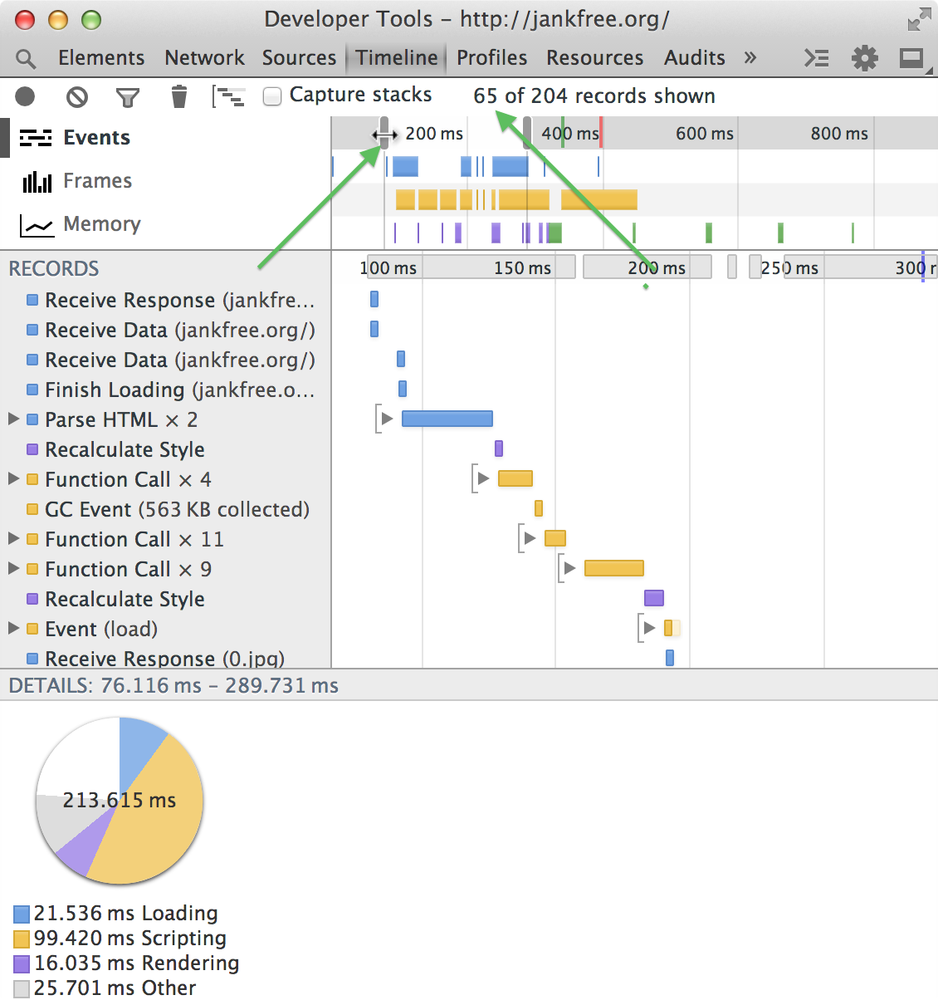
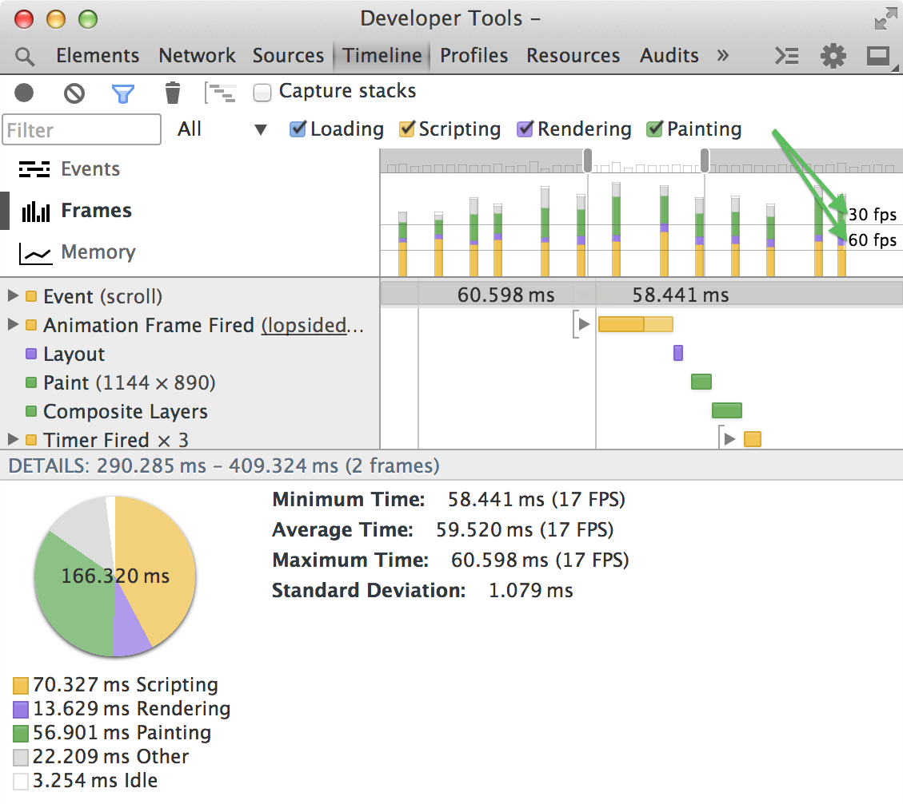
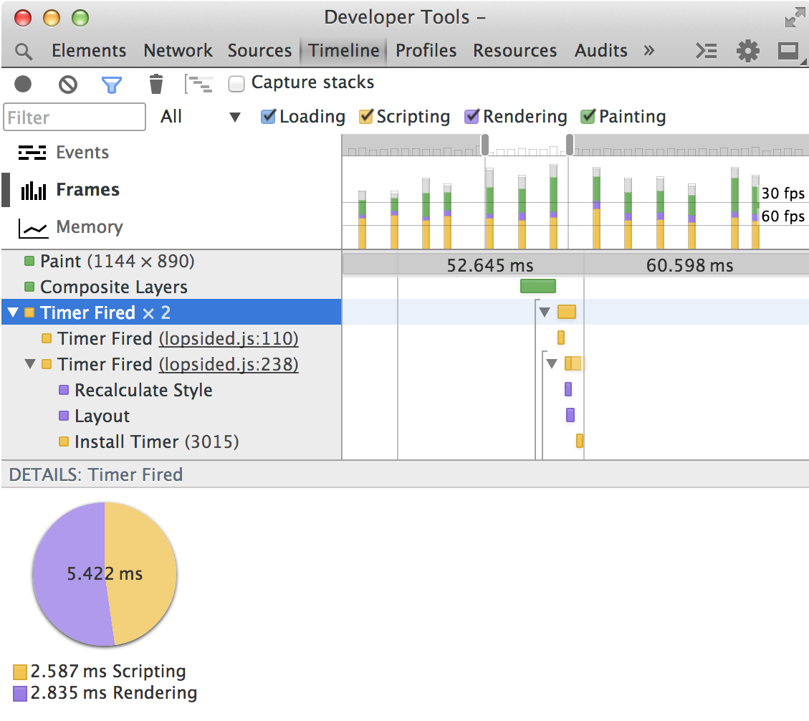
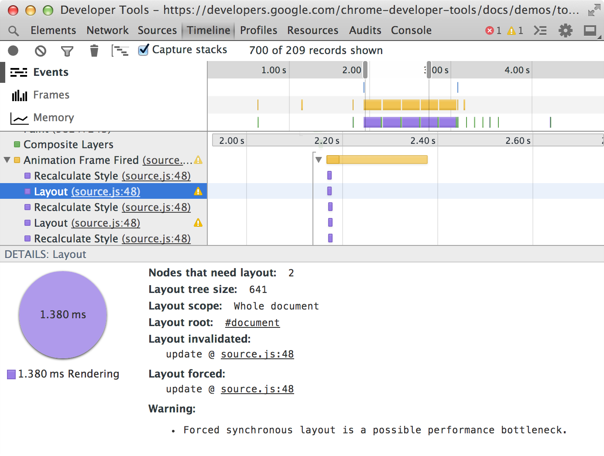
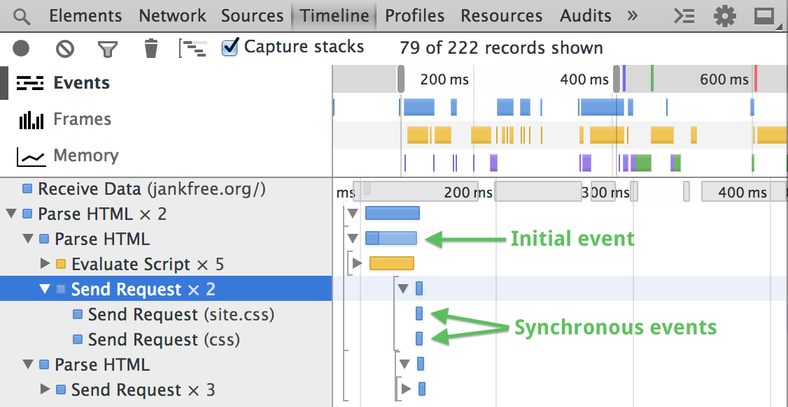
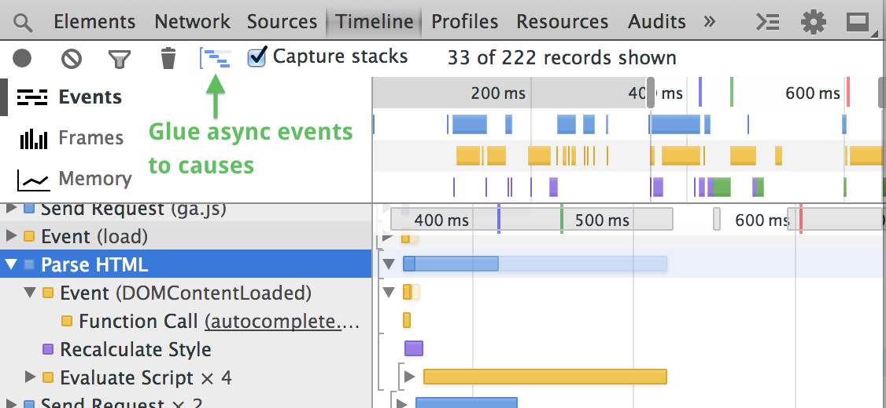
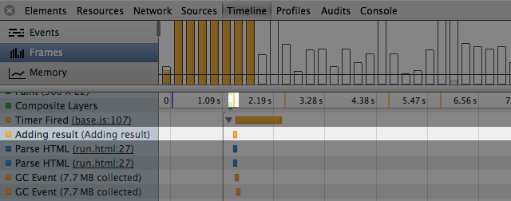

{{+bindTo:partials.standard_devtools_article}}

# <!--@Performance profiling with the Timeline-->使用时间线进行性能分析 #

<!--@The Timeline panel lets you record and analyze all the activity in your application as it runs. It's the best place to start investigating perceived performance issues in your application.-->
时间线面板允许您在应用程序运行时记录和分析它的所有活动，
分析您的应用程序中可察觉到的性能问题时最好从这里开始。

## <!--@Timeline panel overview-->Timeline（时间线）面板概述 ##

<!--@The Timeline has three primary sections: an overview section at the top, a records view, and a toolbar.-->
时间线面板主要有三个部分：顶上的概述部分、记录视图和工具栏。

*  <!--@To start or stop a recording, press the Record toggle button (see
    [Making a recording](#making-a-recording)).-->
按下 Record（记录）开关按钮开始或停止记录
（参见[进行记录](#making-a-recording)）。
*  <!--@Press the Clear recording button to clear records from the Timeline.-->
按下 Clear（清除）按钮从时间线清除记录。
*  <!--@The Glue async events mode lets you more easily correlate asynchronous events to their causes (see [About nested events](#about-nested-events)).-->
Glue async events（关联异步事件）模式可以让您更容易地将
异步事件与导致它的原因联系起来（参见[关于嵌套事件](#about-nested-events)）。
*  <!--@You can filter the records shown in the Timeline according to their type or duration (see [Filtering and searching records](#filtering-and-searching-records)).-->
您可以根据类型或时长过滤时间线中显示的记录
（参见[过滤和搜索记录](#filtering-and-searching-records)）。

<!--@During a recording, a record for each event that occurs is added to the Records view in a "waterfall" presentation. Records are categorized into one of four basic groups: Loading, Scripting, Rendering, and Painting. These records are color-coded as follows:-->
记录过程中，发生每一个事件时都会在记录视图中添加新的记录，以“瀑布”的方式展现。
记录按照四种基本类型分类：Loading（加载）、Scripting（脚本执行）、
Rendering（渲染）和 Painting（绘制）。
这些记录按照下面的方式使用不同的颜色区分：

<!--@For example, the recording below is of an HTML page being loaded into Chrome. The first record (Send Request) is Chrome's HTTP request for the page, followed by a Receive Response record (for the corresponding HTTP response), some Receive Data records (for the actual page data), and then a Finish Loading record. For a complete list of events recorded by Timeline and their descriptions, see the [Timeline event reference](#timeline-event-reference).-->
例如，下面是某个 HTML 网页在 Chrome 浏览器中加载时的记录。
第一条记录（Send Request（发送请求））即 Chrome 浏览器为网页发出的 HTTP 请求，
紧接着是 Receive Response（接收响应）记录（对应于 HTTP 响应）、
一些 Receive Data（接收数据）记录，然后是 Finish Loading（加载完成）记录。
有关时间线所记录的事件列表以及它们的描述，请参见
[时间线事件参考](#timeline-event-reference)。

 

<!--@When you hover over a Timeline record, a pop-up appears with details
<about the associated event. For example, the screenshot below shows
details for a Finish Loading record associated with an image resource. The [Timeline event reference](#timeline-event-reference) explains the details available for each record type.-->
当您把鼠标指向某个时间线记录时，会弹出与事件有关的详情。例如，下面的屏幕截图
显示了一条图片资源 Finish Loading（加载完成）记录的详情。
[时间线事件参考](#timeline-event-reference)解释了每一种记录类型可用的详情。

<!--@In addition to the detailed Records view, you can inspect recordings in one of three modes:-->
除了详细的记录视图，您还可以在以下某一种模式下审查记录：

*  **<!--@Events mode-->事件模式**<!--@ shows all recorded events by event category.-->
按照事件分类显示所有记录的事件。
*  **<!--@Frames mode-->帧模式**<!--@ shows your page's rendering performance.-->
显示网页的渲染性能。
*  **<!--@Memory mode-->内存模式**<!--@ shows your page's memory usage over time.-->
显示网页在一段时间内的内存使用情况。

### <!--@Events mode-->事件模式 ###

<!--@The Events mode provides an overview of all events that were captured during the recording, organized by their type. At a glance, you can see where your application is spending the most time, and on what types of tasks. The length of each horizontal bar in this view corresponds to time that event took to complete.-->
事件模式提供了记录过程中捕获的所有事件的概述，按照它们的类型组织。
粗略一看，您就能看出应用程序在什么地方、哪些类型的任务上花费的时间最多。
视图中每一横条对应事件完成所使用的时间。

<!--@When you select a range of time from the Events view (see [Zooming in on a Timeline section](#zooming-in-on-a-timeline-section)), the Records view is restricted to only show those records.-->
当您在事件视图中选择某个时间范围时（参见
[将时间线中的某一部分放大](#zooming-in-on-a-timeline-section)），
记录视图只显示范围内的记录。

### <!--@Frames mode-->帧模式 ###

<!--@Frames mode provides insight into the rendering performance of your application. A "frame" represents the work the browser must do to render a single frame of content to the display&mdash;run JavaScript, handle events, update the DOM and change styles, layout and paint the page. The goal is for your app to run at 60 frames per second (FPS), which corresponds to the 60Hz refresh rate of most (but not all) video displays. Consequently, your application has approximately 16.6 ms (1000 ms / 60) to prepare for each frame.-->
帧模式为您提供应用程序渲染性能的详细情况。
“帧”代表浏览器渲染一帧内容并显示出来时所要做的工作——
运行 JavaScript、处理事件、更新 DOM、更改样式和布局、绘制网页。
您的目标是使应用能够以 60 帧每秒（FPS）的速度运行，
对应于大部分（但不是所有）显示器 60Hz 的刷新率。
也就是说，您的应用大约有 16.6 毫秒（1000 ms / 60）的时间为每一帧做准备。

<!--@Horizontal lines across the Frames view represent frame rate targets for 60 FPS and 30 FPS. The height of a frame corresponds to the time it took to render that frame. The colors filling each frame indicate the percentage of time taken on each type of kind of task.-->
帧视图中的横线代表 60 FPS 与 30 FPS 的目标帧率，帧的高度对应于渲染时花费的时间。
每一帧的填充颜色代表每种任务花费时间所占的百分比。

<!--@The time to render a frame is displayed atop of the Records view. If you hover over the displayed time, additional information appears about the frame, including the time spent on each type of task, CPU time, and the calculated FPS.-->
渲染一帧的时间显示在记录视图上方。如果您将鼠标悬停在显示的时间上，
就会显示帧的其他信息，包括每种任务花费的时间、CPU 时间以及计算出来的 FPS。

<!--@See [Timeline demo: Diagnosing and fixing forced synchronous
layout](demos/too-much-layout/) for a demonstration of using Frames mode.-->
有关帧模式的演示，请参见[时间线演示：诊断和修复强制同步布局问题](demos/too-much-layout/index)。

#### <!--@About clear or light-gray frames-->关于空白或浅灰色帧 ####

<!--@You may notice regions of a frame that are light-gray or clear (hollow). These regions indicate, respectively:-->
您可能会注意到某些帧的一部分区域是浅灰色或空白的，这些区域分别表示：

* <!--@Activity that was not instrumented by DevTools-->
开发者工具未记录的活动
* <!--@Idle time between display refresh cycles.-->
显示刷新周期之间的空闲时间。

<!--@The frames in the recording below show both un-instrumented activity and idle time.-->
以下记录中的帧既包含未记录的活动，还包含空闲时间。

<!--@Want more details on the empty white space within the bars? Read <a href="https://plus.google.com/+NatDuca/posts/BvMgvdnBvaQ?e=-RedirectToSandbox">Chrome Engineer Nat Duca's explanation</a>, which describes how you can evaluate if you were bottlnecked by the GPU. -->
还想了解条形图中空白的更多详情吗？
请阅读 <a href="https://plus.google.com/+NatDuca/posts/
BvMgvdnBvaQ?e=-RedirectToSandbox">
Chrome 工程师 Nat Duca 的解释</a>，描述了您应该如何确定瓶颈是否在 GPU 上。

#### <!--@Viewing frame rate statistics-->查看帧率统计 ###

<!--@The average frame rate and its standard deviation represented are displayed along the bottom of the Timeline panel for the selected frame range. If you hover over the average frame rate, a pop-up appears with additional information about the frame selection:-->
选定帧范围内的平均帧率及其标准差显示在时间线面板右下角，
同时还会显示其他相关信息：

* **<!--@Selected range-->选定范围**<!--@ -- The selected time range, and the number of frames in the selection.-->
——选择的时间范围以及范围内包含的帧数
* **Minimum Time**<!--@ -- The lowest time of the selected frames, and the corresponding frame rate in parentheses.-->
（最低时间）——选定范围内帧之间的最低时间，括号中显示对应的帧率。
* **Average Time**<!--@ -- The average time of the selected frames,  and the corresponding frame rate in parentheses.-->
（平均时间）——选定范围内的平均时间，括号中显示对应的帧率。
* **Maximum Time**<!--@ -- The maximum time for the selected range, and the corresponding frame rate in parentheses.-->
（最高时间）——选定范围内的最高时间，括号中显示对应的帧率。
* **Standard Deviation**<!--@ -- The amount of variability of the calculated Average Time.-->
（标准差）——偏离计算出平均时间的多少。
* **<!--@Time by category-->每类过程花费的时间**<!--@ -- The amount of time spent on each type of process, color-coded by type.-->
——每类过程花费的时间多少，以对应类型的颜色显示。

### <!--@Memory mode-->内存模式

<!--@The Memory view shows you a graph of memory used by your application
over time and maintains a counter of the number of documents, DOM
nodes, and event listeners that are held in memory (that is, that
haven’t been garbage collected).-->
内存视图为您显示应用程序一段时间内的内存占用图，
并记录内存中（即还未经过垃圾回收）的文档、DOM 节点和事件监听器数目。

<!--@Memory mode can't show you exactly what is causing a memory leak, but it can help you identify what events in your application may be leading to a memory leak. You can then use the [Heap Profiler](heap-profiling.html) to identify the specific code that is causing the leak.-->
内存模式并不能为您显示到底是什么导致了内存泄漏，
但是可以帮您识别应用程序中哪些事件会导致内存泄漏。
您可以接着使用[堆性能分析器](heap-profiling.html)找出导致泄漏的特定代码。

### <!--@Making a recording-->进行记录 ###

<!--@To make a recording, you start a recording session, interact with your application, and then stop recording. It helps to know in advance the kind of activity you want to record — for example, page loading, scrolling performance of a list of images, and so forth, and then stick to that script.-->
要进行记录，您首先要开始记录会话，然后与您的应用程序交互，最后停止记录。
事先知道您希望记录的活动类型（例如网页加载、一系列图片的滚动性能等等）
然后着重关注它们会很有帮助。

**<!--@To make a recording-->要进行记录**<!--@:-->：

<ol>
    <li><!--@Open the page you want to record.-->打开您希望记录的网页。</li>
    <li><!--@Open the Timeline panel and start recording by doing one of the following:-->打开时间线面板，使用以下任意一种方式开始记录：</li>
    <ul>
        <li><!--@Click the round record button at the bottom of the Timeline panel. -->单击时间线面板顶部的圆形记录按钮。</img></li>
        <li><!--@Press the keyboard shortcut Ctrl+E, or Cmd+E on Mac.-->
        按下键盘快捷键 Ctrl+E 或 Mac 上的 Cmd+E。
        </li>
    </ul>
    
<!--@The Record button turns red during a recording. -->记录过程中 Record（记录）按钮变成红色。</img> 

    <li><!--@Perform any necessary user actions to record the desired behavior.-->进行必要的用户操作，记录期望的行为。</li>
    <li><!--@Stop the recording by pressing the now red record button, or
    repeating the keyboard shortcut.-->
    按下现在为红色的记录按钮或重复使用键盘快捷键停止记录。
    </li>
</ol>

### <!--@Recording a page load-->记录网页的加载 ###

<!--@A common task is to record a page loading from the initial network request. Keyboard shortcuts are useful in this scenario, as they let you quickly start a recording, re-load the page, and stop the recording.-->
从第一次网络请求开始记录网页的加载过程是一种常见的任务。
在这种情况下键盘快捷键很有用，可以让您迅速开始记录、重新加载网页并停止记录。

**<!--@To record a page load-->要记录网页的加载**<!--@:-->：

1.  <!--@Open any [web page](http://www.jankfree.com) in a new tab or window.-->
在新标签页或新窗口中打开任意[网页](http://www.jankfree.com)。
2.  <!--@Open the Timeline and press Cmd+E (Mac) or Ctrl+E (Windows/Linux) to start recording.-->
打开时间线面板并按下 Cmd+E（Mac）或 Ctrl+E（Windows/Linux）开始记录。
3.  <!--@Quickly press Cmd+R or Ctrl+R to reload the browser page.-->
迅速按下 Cmd+R 或 Ctrl+R 重新加载浏览器中的网页。
4.  <!--@Stop the recording when the page has finished loading (look for the red [event marker](#domcontentloaded-and-load-event-markers)).-->
网页加载完成后停止记录（寻找红色的[事件标记](#domcontentloaded-and-load-event-markers)）。

<!--@Your recording should look something like the following. The first
record (Send Request) is Chrome's HTTP request for the page, followed by a Receive Response record for the corresponding HTTP response, followed by one or more Receive Data records, a Finish Loading record, and a Parse HTML record.-->
您的记录应该像下面这样。第一条记录（Send Request）
是 Chrome 浏览器为网页发出的 HTTP 请求，接着是一个或多个 Receive Data
（接收数据）记录、一条 Finish Loading（加载完成）记录，然后是 Parse HTML
（分析 HTML）记录。

<!--@See the [Timeline event reference](#timeline-event-reference) for details on each record type.-->
有关每一种记录类型的详情请参见[时间线事件参考](#timeline-event-reference)。

### <!--@Tips for making recordings-->进行记录的技巧 ###

<!--@Here are some tips for making recordings:-->
如下是进行记录时的一些技巧：

* **<!--@Keep recordings as short as possible-->记录要尽可能时间短**<!--@. Shorter recordings generally make analysis easier.-->，
通常时间短的记录分析器来比较容易。
* **<!--@Avoid unnecessary actions-->避免不必要的操作**<!--@. Try to avoid actions (mouse clicks, network loads, and so forth) that are extraneous to the activity you want to record and analyze. For instance, if you want to record events that occur after you click a “Login” button, don’t also scroll the page, load an image and so forth.-->。
尽量避免除了您希望记录与分析的操作以外的其他动作（单击鼠标、网络加载等等）。
例如，如果您希望记录单击“登录”按钮后的事件，那就不要同时滚动网页、加载图片等等。
*  **<!--@Disable the browser cache-->禁用浏览器缓存**<!--@. When recording network operations, it’s a good idea to disable the browser’s cache in the DevTools Settings panel.-->。
记录网络操作时，最好在开发者工具的设置面板中禁用浏览器缓存。
* **<!--@Disable extensions-->禁用扩展程序**<!--@. Chrome extensions can add unrelated noise to Timeline recordings of your application. You can do one of the following:-->。
Chrome 浏览器的扩展程序可能会在您应用程序的时间线记录中增加不相关的干扰，您可以采用以下任意一种方法：
    * <!--@Open a Chrome window in [incognito
    mode](http://support.google.com/chrome/bin/answer.py?hl=en&answer=95464)-->
    在[隐身模式](https://support.google.com/chrome/answer/95464?hl=zh-Hans)
    下打开 Chrome 浏览器窗口。
    * <!--@Create a new [Chrome user
    profile](http://support.google.com/chrome/bin/answer.py?hl=en&answer=142059) for
    testing.-->
    创建新的 [Chrome 用户配置文件](https://support.google.com/chrome/answer/142059?hl=zh-Hans)
    用于测试。

## <!--@Analyzing Timeline recordings-->分析时间线记录 ##

<!--@This section provides tips for analyzing Timeline recordings.-->
这一部分提供了分析时间线记录的技巧。

### <!--@Viewing details about a record-->查看记录详情 ###

<!--@When you select a record in the Timeline, the Details pane displays additional information about the event.-->
当您在时间线中选中某条记录时，Details（详情）窗格会显示事件的其他信息。

<!--@Certain details are present in events of all types, such as Duration and CPU Time, while some only apply to certain event types. For information on what details each kind of record contains, see the [Timeline event reference](#timeline-event-reference).-->
一些信息在所有类型的事件中都存在，例如 Duration（时长）和 CPU Time（CPU 时间），
而另外一些只适用于某些类型的事件。有关每一类记录包含哪些详情，请参见
[时间线事件参考](#timeline-event-reference)。

<!--@When you select a Paint record, DevTools highlights the region of the screen that was updated with a blue semi-transparent rectangle, as shown below.-->
当您选中一条 Paint（绘制）记录时，开发者工具会用蓝色的半透明矩形高亮显示
屏幕中更新的区域，如下所示。

### <!--@DOMContentLoaded and Load event markers-->DOMContentLoaded 和 Load 事件标记 ###

<!--@The Timeline annotates each recording with a blue and a red line that indicate, respectively, when the [DOMContentLoaded](http://docs.webplatform.org/wiki/dom/events/DOMContentLoaded) and [load](http://docs.webplatform.org/wiki/dom/events/load) events were dispatched by the browser. The DOMContentLoaded event is fired when all of the page’s DOM content has been loaded and parsed. The load event is fired once all of the document’s resources (images and CSS files, and so forth) have been fully loaded.-->
每一次记录中，时间线中都会包含一条蓝线和一条红线，
分别表示浏览器分发了 [DOMContentLoaded](http://docs.webplatform.org/wiki/dom/Event/DOMContentLoaded) 和 [load](http://docs.webplatform.org/wiki/dom/Element/load) 事件。
网页中所有 DOM 内容加载并分析完成后产生 DOMContentLoaded 事件，
文档的所有资源（图片、CSS 文件等等）加载完成后产生 load 事件。

### <!--@Locating forced synchronous layouts-->寻找强制同步布局

<!--@Layout is the process by which Chrome calculates the positions and sizes of all the elements on the page. Normally, Chrome performs layouts "lazily" in response to CSS or DOM updates from your application. This allows Chrome to batch style and layout changes rather than reacting to each on demand. However, an application can force Chrome to perform a layout immediately and asynchronously by querying the value of certain layout-dependent element properties such as `element.offsetWidth`. These so called "forced synchronous layouts" can be a big performance bottleneck if repeated frequently or performed for large DOM tree.-->
Chrome 浏览器计算网页中所有元素位置与大小的过程称为布局。
正常情况下，Chrome 浏览器响应应用程序中的 CSS 或 DOM 更新进行延迟布局。
这样一来，Chrome 浏览器就可以批量处理样式和布局更改，
而不是每一次需要时都重新计算。然而，
应用程序可以以同步的方式强制 Chrome 浏览器立即进行布局，
<!--# should be synchronously instead of asynchronously? -->
只要查询某些与布局相关的元素属性，例如 `element.offsetWidth` 即可。
这就是所谓的“强制同步布局”，
如果经常发生或者在巨型 DOM 树上进行的话就有可能成为性能瓶颈。

<!--@The Timeline identifies when your application causes a forced asynchronous layout and marks such records with yellow warning icon (). When you select the record, the details pane contains a stack trace of the offending code.-->
时间线可以辨别您的应用程序什么时候产生强制同步布局，
并用黄色警告图标（）标记这些记录。
当您选择这样的记录时，详情窗格包含相关代码的堆栈跟踪。

<!--@If a record contains a [child record](#about-nested-events) that forced a layout, the parent record is marked with a slightly dimmed yellow icon. Expand the parent record to locate the child record that caused the forced layout.-->
如果记录包含强制产生布局的[子记录](#about-nested-events)，
上一级记录会用淡黄色图标标记，展开上一级记录就能寻找强制产生布局的子记录。

<!--@See the [Forced Synchronous Layout
demo](demos/too-much-layout/index.html) for a demonstration
of detecting and fixing these kinds of performance issues.-->
有关检测和修复这类性能问题的演示，请参见<a 
href="demos/too-much-layout/index.html">强制同步布局演示</a>。

### <!--@About nested events-->关于嵌套事件 ###

<!--@Events in Timeline recordings sometimes are nested visually beneath another event. You expand the "parent" event to view its nested "child" events. There are two reasons why the Timeline nests events:-->
时间线记录中的事件有时候显示时会嵌套在另一个事件下，
您可以展开“父”事件查看嵌套的“子”事件。时间线嵌套事件是因为这两个原因：

*  <!--@Synchronous events that occurred during the processing of an event that occurred previously. Each event internally generates two atomic events, one for the start and one for the end, that are converted to a single "continuous" event. Any other events that occur between these two atomic events become children of the outer event.-->
处理之前发生的事件时，发生了同步事件。在内部每个事件会生成两个原子事件，
一个对应着开始，一个对应着结束，最后转换成单个“连续的”事件。
这两个原子事件之间发生的其他事件就变成了外层事件的子事件。
*  <!--@Asynchronous events that occurred as a result of another event when [glue mode](#about-glue-mode) is enabled.-->
如果启用了[关联模式](#about-glue-mode)，
由于另一个事件而产生的异步事件也会嵌套在内。

<!--@Note: Glue mode is automatically disabled in [Frames mode](#frames-mode).-->
注：在[帧模式](#frames-mode)下会自动禁用关联模式。

<!--@The following screenshot shows an example of nested synchronous events. In this case, Chrome was parsing some HTML (the Parse HTML event) when it found several external resources that needed to be loaded. Those requests were made before Chrome has finished the parsing, so the Send Request events are displayed as children of the Parse HTML event.-->
以下屏幕截图显示的是一个嵌套同步事件的例子。在这里，
Chrome 浏览器分析 HTML（Parse HTML 事件）时发现需要加载一些外部资源。
这些请求在 Chrome 浏览器完成分析前就产生了，所以 Send Request（发送请求）
事件显示为 Parse HTML（分析 HTML）事件的子事件。

#### <!--@About glue mode-->关于关联模式 ####

<!--@Many events in an application are the result of asynchronous operations. A loading of an image resource  page results in a Send Request, followed by a Receive Response event, one or more Receive Data loading events, and a Finish Loading event. Sometimes, async events are separated from their causes by enough time to make correlating them difficult.-->
应用程序中许多事件都是由异步操作产生的。加载图片资源产生 Send Request
（发送请求）事件，紧接着 Receive Response（接收响应）事件，
然后是一个或多个 Receive Data（接收数据）的加载事件，最后是 Finish Loading
（加载完成）事件。有时，异步事件与导致它们的原因之间隔了很长时间，
将它们联系起来很困难。

<!--@The **Glue asynchronous events to causes** toggle at the bottom of the Timeline panel causes asynchronous events to be nested as children of the event that caused them.-->
时间线面板顶部的 **Glue asynchronous events to causes**（关联异步事件）开关
使异步事件嵌套在导致它们的事件内，成为子事件。

#### <!--@Coloring of Timeline records with nested events-->时间线记录中子事件的颜色

<!--@Timeline bars are color coded as follows:-->
时间线中的横条根据下面的规则使用不同的颜色：

*  <!--@The **first, darkest part** of the bar represents how long the parent event and all of its _synchronous_ children took.-->
横条**最前面、颜色最深的部分**代表父事件和所有*同步*子事件花费的时间。
*  <!--@The **next, slightly paler color** represents the CPU time that the event and all its _asynchronous_ children took. This would be the same as above if [glue mode](#about-glue-mode) is off, and for events that don't have asynchronous children.-->
**接下来颜色略浅的部分**代表事件和所有*异步*子事件花费的 CPU 时间。
如果[关联模式](#about-glue-mode)未开启或没有异步子事件，那就和上面一致。
*  <!--@The **palest bars** represent the time from the start of first asynchronous event to the end of last of its asynchronous children (only visible for events with asynchronous children while in glue mode).-->
**颜色最浅的横条**代表从第一个异步事件到最后一个异步子事件之间经过的时间
（只有在关联模式下并且包含异步子事件时才可见）。

<!--@Selecting a parent record will display the following in the Details pane:-->
选择上一级记录后，详情窗格中会显示如下信息：

*  **<!--@Event type summary-->事件类型概述**<!--@ in text and visualized in a pie chart.-->以文字和饼图的形式显示。
*  **Used JS Heap size**<!--@ at this point in the recording, and what this operation's effect was to the heap size.-->
（使用的 JS 堆大小）：在记录的这一点该操作对堆大小产生的影响。
*  <!--@**Other details** relevant to the event.-->
与事件相关的**其他详情**。

### <!--@Filtering and searching records-->过滤和搜索记录 ###

<!--@You can filter the records shown according to their type (only show loading events, for example), or only show records longer or equal to 1 millisecond or 15 milliseconds. You can also filter the view to show events that match a string.-->
您可以根据类型（例如只显示加载事件）过滤显示的记录，
或者只显示超过 1 毫秒或 15 毫秒的记录。
您还可以只显示匹配某个字符串的事件来过滤视图。

<!--@While looking at all the events, you may want to hunt for one, but maintain context of what's around it. In this case, you can find without filtering. Press Ctrl+F (Window/Linux) or Cmd+F (Mac), while the Timeline has focus to show those that contain the search term.-->
查看所有事件时，您可能需要寻找其中某一个，但同时还需要保留周围的上下文。
这时候，您可以查找而不是过滤。
当焦点位于时间线面板时按下 Ctrl+F（Window/Linux）或 Cmd+F（Mac），
就可以显示包含搜索条目的事件。

### <!--@Zooming in on a Timeline section-->将时间线中的某一部分放大 ###

<!--@To make analyzing records easier, you can “zoom in” on a section of the timeline overview, which reduces accordingly the time scale in the Records view.-->
为了更容易分析记录，您可以将时间线概述中的某一部分“放大”，
相应地减小记录视图中的时间标尺。

<!--@To zoom in on a Timeline section, do one of the following:-->
您可以使用以下任意一种方式将时间线的某一部分放大：

* <!--@In the overview region, drag out a Timeline selection with your mouse.-->
在概述区域用鼠标拖动并选择时间线中的某一部分。
* <!--@Adjust the gray sliders in the ruler area.-->
调节标尺区域中的灰色滑块。

<!--@Here are some more tips for working with Timeline selections:-->
下面是选择时间线时的一些技巧：

*  <!--@"Scrub" the recording with the current selection by dragging the area between the two slider bars. -->
使用当前选择的部分拖动两个滑块之间的区域“刷洗”记录。

*  <!--@Trackpad users:-->
触摸板用户：

    *  <!--@Swiping left or right with two fingers moves the current Timeline selection.-->
    用两只手指向左或向右扫过可以移动时间线中当前选定部分。
    *  <!--@Swiping up or down with two fingers expands or contracts the current Timeline selection, respectively.-->
    用两只手指向上或向下扫过分别可以扩展或缩小时间线中当前选定部分。

*  <!--@Scrolling the mouse wheel up or down while hovering over a Timeline selection expands and contracts the selection, respectively.-->
将鼠标悬停在时间线选择区域时向上或向下滚动滚轮，分别可以扩大或缩小选定部分。

### <!--@Saving and loading recordings-->保存和加载记录 ###

<!--@You can save a Timeline recording as a JSON file, and later open it in the Timeline.-->
您可以将时间线记录保存为 JSON 文件，之后可以在时间线中打开。

**<!--@To save a Timeline recording:-->要保存时间线记录：**

1.  <!--@Right+click or Ctrl+click (Mac only) inside the Timeline and select **Save Timeline Data…**, or press the Ctrl+S keyboard shorcut.-->
右键单击或按住 Ctrl 单击（仅限于 Mac）时间线面板内部，
并选择 **Save Timeline Data…**（保存时间线数据），或者按下 Ctrl+S 快捷键。
2. <!--@Pick a location to save the file and click Save.-->
选择保存文件的位置并单击保存。

**<!--@To open an existing Timeline recording file, do one of the following**-->要打开现有的时间线记录文件，请使用以下任意一种方式：**

1. <!--@Right-click or Ctrl+click inside the Timeline and select **Load Timeline Data...**, or press the Ctrl+O keyboard shortcut.-->
右键单击或按住 Ctrl 单击（仅限于 Mac）时间线面板内部，
并选择 **Load Timeline Data…**（加载时间线数据），或者按下 Ctrl+S 快捷键。
2. <!--@Locate the JSON file and click Open.-->
找到 JSON 文件并单击打开。

### <!--@User-produced Timeline events-->用户产生的时间线事件 ###

<!--@Applications can add their own events to Timeline recordings. You can use the
[console.timeStamp()](console-api.md#consoletimestamplabel) method to add an atomic event to a recording, or the
[console.time()](console-api.md#consoletimelabel) and
[console.timeEnd()](console-api.md#consoletimeendlabel) methods
to mark a range of time that code was executing. For example, in the following recording the `console.timeStamp()` was used to display an "Adding result" event. See [Marking the Timeline](console.md#marking-the-timeline) in
[Using the Console](console.md) for more information.-->
应用程序可以在时间线记录中添加自己的事件。
您可以使用 [console.timeStamp()](console-api.md#consoletimestamplabel) 方法
在记录中添加原子事件，
或使用 [console.time()](console-api.md#consoletimelabel) 和 
[console.timeEnd()](console-api.md#consoletimeendlabel) 方法
标记代码执行的时间范围。
例如，在下面的记录里使用了 `console.timeStamp()` 显示“Adding result”
（添加结果）事件。有关更多信息，请参见[使用控制台](console.md)中的
[标记时间线](console.md#marking-the-timeline)。

### <!--@View CPU time in recordings-->查看记录中的 CPU 时间 ###

<!--@You will see ight gray bars appearing above the Timeline records, indicating when the CPU was busy. Hovering over a CPU bar highlights the Timeline region during which the CPU was active (as shown below). The length of a CPU bar is typically the sum of all the (highlighted) events below it in the Timeline. If these don't match, it may be due to one of the following:-->
您会在时间线记录上看到浅灰色的横条，表示 CPU 正忙。
将鼠标悬停在 CPU 条上会高亮显示 CPU 活动时的时间线区域（如下所示）。
CPU 条的长度通常是下面时间线中所有（高亮部分）事件的总和。
如果它们不匹配，可能是因为以下某种原因：

* <!--@Other pages running on the same threads as the page being inspected (for example, two tabs open from the same site, with one site doing something in a `setTimeout()` call).-->
审查网页时，还有其他网页在同一线程上运行
（例如打开两个同一网站的标签页，
其中一个正在使用 `setTimeout()` 调用做一些工作）。
* <!--@Un-instrumented activity.-->
未记录的活动。

## <!--@Timeline event reference-->时间线事件参考 ##

<!--@This section lists and describes the individual types of records that are generated during a recording, organized by type, and their properties.-->
这一部分列举并描述了记录过程中产生的每一种类型的记录及其属性，按照类型组织。

### <!--@Common event properties-->通用事件属性 ###

<!--@Certain details are present in events of all types, while some only apply to certain event types. This section lists properties common to different event types. Properties specific to certain event types are listed in the references for those event types that follow.-->
某些信息在所有类型的事件中都存在，而某些仅在一部分事件类型中出现。
这一部分列出了各种事件类型共有的属性，与特定事件类型有关的属性在
后面各自的事件类型参考中列出。

Aggregated time（累计时间）
:   <!--@For events with <a href="#about-nested-events">nested events</a>, the time taken by each category of events.-->
对于具有<a href="#about-nested-events">内嵌事件</a>的事件来说，
包含每一类事件花费的时间。

Call Stack（调用堆栈）
:   <!--@For events with <a href="#about-nested-events">child events</a>, the time taken by each category of events.-->
对于具有<a href="#about-nested-events">子事件</a>的事件来说，
包含每一类事件花费的时间。

CPU time（CPU 时间）
:   <!--@How much CPU time the recorded event took.-->
记录的事件花费了多少 CPU 时间。

Details（详情）
:   <!--@Other details about the event.-->
有关事件的其他详情。

Duration<!--@ (at time-stamp)-->（时长）（时间戳）
:   <!--@How long it took the event with all of its children to complete; <em>timestamp</em> is the time at which the event occurred, relative to when the recording started.-->
该事件及所有子事件花费多少时间完成。<em>时间戳</em>是事件发生时的时间，
相对于记录开始的时候。

Self time（自身花费的时间）
:   <!--@How long the event took without any of its children.-->
事件花费的时间，不包括子事件。

Used Heap Size（使用的堆大小）
:   <!--@Amount of memory being used by the application when the event was recorded, and the delta (+/-) change in used heap size since the last sampling.-->
事件记录时应用程序使用的内存以及与上一次采样相比使用的堆大小变化（+/-）。

### <!--@Loading events-->加载事件 ###

<!--@This section lists events that belong to Loading category and their properties.-->
这一部分列举了属于 Loading（加载）分类的事件及其属性。

<table class="property-table">
    <tr>
        <th><!--@Event-->事件</th>
        <th><!--@Description-->描述</th>
    </tr>
    <tr>
        <td>Parse HTML（分析 HTML）</td>
        <td><!--@Chrome executed its HTML parsing algorithm.-->
        Chrome 浏览器执行 HTML 分析算法。</td>
    </tr>
    <tr>
        <td>Finish Loading（载入完成）</td>
        <td><!--@A network request completed.-->网络请求完成。</td>
    </tr>
    <tr>
        <td>Receive Data（接收数据）</td>
        <td><!--@Data for a request was received. There will be one or more Receive Data events.-->请求的数据已经收到。可能会有一个或多个接收数据事件。</td>
    </tr>
    <tr>
        <td>Receive Response（接收响应）</td>
        <td><!--@The initial HTTP response from a request.-->请求最初的 HTTP 响应。</td>
    </tr>
    <tr>
        <td>Send Request（发送请求）</td>
        <td><!--@A network request has been sent.-->网络请求已经发送。</td>
    </tr>
</table>

#### <!--@Loading event properties-->加载事件的属性 ####

Resource（资源）
:   <!--@The URL of the requested resource.-->
请求资源的 URL。

Preview（预览）
:   <!--@Preview of the requested resource (images only).-->
请求资源的预览（仅用于图片）。

Request Method（请求方法）
:   <!--@HTTP method used for the request (GET or POST, for example).-->
请求使用的 HTTP 方法（例如 GET 或 POST）。

Status Code（状态码）
:   HTTP <!--@response code-->响应代码

MIME Type（MIME 类型）
:   <!--@MIME type of the requested resource.-->
请求资源的 MIME 类型。

Encoded Data Length（编码后的数据长度）
:   <!--@Length of requested resource in bytes.-->
请求的资源长度，以字节为单位。

### <!--@Scripting events-->脚本事件 ###

<!--@This section lists events that belong to the Scripting category and their properties.-->
这一部分列举了属于 Scripting（脚本）分类的事件及其属性。

<table class="property-table">
    <tr>
        <th><!--@Event-->事件</th>
        <th><!--@Description-->描述</th>
    </tr>
    <tr>
        <td>Animation Frame Fired（产生动画帧）</td>
        <td><!--@A scheduled animation frame fired, and its callback handler invoked.-->
        产生调度好的动画帧，执行回调处理程序。
        </td>
    </tr>
    <tr>
        <td>Cancel Animation Frame（取消动画帧）</td>
        <td><!--@A scheduled animation frame was canceled.-->调度的动画帧被取消。</td>
    </tr>
    <tr>
        <td>GC Event（垃圾回收事件）</td>
        <td><!--@Garbage collection occurred.-->发生了垃圾回收事件。</td>
    </tr>
    <tr>
        <td>DOMContentLoaded</td>
        <td><!--@The <a href="http://docs.webplatform.org/wiki/dom/events/DOMContentLoaded">DOMContentLoaded</a> was fired by the browser. This event is fired when all of the page’s DOM content has been loaded and parsed.-->
        浏览器产生了 <a href="http://docs.webplatform.org/wiki/dom/Event/DOMContentLoaded">
        DOMContentLoaded</a> 事件。网页中的所有 DOM
        内容加载和分析完成后产生该事件。
        </td>
    </tr>
    <tr>
        <td>Evaluate Script（执行脚本）</td>
        <td><!--@A script was evaluated.-->执行了某个脚本。</td>
    </tr>
    <tr>
        <td>Event（事件）</td>
        <td><!--@A JavaScript event ("mousedown", or "key", for example).-->
        JavaScript 事件（例如 "mousedown" 或 "key"）。
        </td>
    </tr>
    <tr>
        <td>Function Call（函数调用）</td>
        <td><!--@A top-level JavaScirpt function call was made (only appears when browser enters JavaScript engine).-->
        调用了顶层 JavaScript 函数（仅在浏览器进入 JavaScript 引擎时产生).
        </td>
    </tr>
    <tr>
        <td>Install Timer（安装定时器）</td>
        <td><!--@A timer was created with <a href="http://docs.webplatform.org/wiki/dom/methods/setInterval">setInterval()</a> or <a href="http://docs.webplatform.org/wiki/dom/methods/setTimeout">setTimeout()</a>.-->
        使用 <a href="http://docs.webplatform.org/wiki/dom/Window/setInterval">setInterval()</a>
        或
        <a href="http://docs.webplatform.org/wiki/dom/Window/setTimeout">setTimeout()</a>
        创建定时器。
        </td>
    </tr>
    <tr>
        <td>Request Animation Frame（请求动画帧）</td>
        <td><!--@A requestAnimationFrame() call scheduled a new frame-->
        调用 requestAnimationFrame() 调度新帧。
        </td>
    </tr>
    <tr>
        <td>Remove Timer（移除定时器）</td>
        <td><!--@A previously created timer was cleared.-->
        之前创建的定时器被清除。
        </td>
    </tr>
    <tr>
        <td>Time（开始计时）</td>
        <td><!--@A script called <a href="console-api.md#consoletimelabel">console.time()</a>)-->
        脚本调用了 <a href="console-api.md#consoletimelabel">console.time()</a>。
        </td>
    </tr>
    <tr>
        <td>Time End（停止计时）</td>
        <td><!--@A script called
<a href="console-api.md#consoletimeendlabel">console.timeEnd()</a>-->
脚本调用了 <a href="console-api.md#consoletimeendlabel">console.timeEnd()</a>。
</td>
    </tr>
    <tr>
        <td>Timer Fired（定时器触发）</td>
        <td><!--@A timer fired that was scheduled with setInterval() or setTimeout().-->
        使用 setInterval() 或 setTimeout() 调度的定时器触发。
        </td>
    </tr>
    <tr>
        <td>XHR Ready State Change（XHR 就绪状态更改）</td>
        <td><!--@The ready state of an XMLHTTPRequest changed.-->
        XMLHttpRequest 对象的就绪状态更改。
        </td>
    </tr>
    <tr>
        <td>XHR Load（通过 XHR 加载完成）</td>
        <td><!--@An XMLHTTPRequest finished loading.-->
        XMLHttpRequest 请求加载完成。
        </td>
    </tr>
</table>

#### <!--@Scripting event properties-->脚本事件的属性 ####

Timer ID（定时器标识符）
:   <!--@The timer ID.-->
定时器标识符。

Timeout（超时时间）
:   <!--@The timeout specified by the timer.-->
定时器指定的超时时间。

Repeats（重复）
:   <!--@Boolean that specifies if the timer repeats.-->
指定定时器是否重复的布尔值。

Function Call（函数调用）
:   <!--@A function that was invoked.-->
调用了某个函数。

### <!--@Rendering events-->渲染事件 ###

<!--@This section lists events that belong to Rendering category and their properties.-->
这一部分列举了属于 Rendering（渲染）分类的事件及其属性。

<table class="property-table">
    <tr>
        <th><!--@Event-->事件</th>
        <th><!--@Description-->描述</th>
    </tr>
    <tr>
        <td>Invalidate layout（需要重新布局）</td>
        <td><!--@The page layout was invalidated by a DOM change.-->
        由于 DOM 更改，网页需要重新布局。
        </td>
    </tr>
    <tr>
        <td>Layout（布局）</td>
        <td><!--@A page layout was executed.-->进行一次网页布局。</td>
    </tr>
    <tr>
        <td>Recalculate style（重新计算样式）</td>
        <td><!--@Chrome recalculated element styles.-->
        Chrome 浏览器重新计算元素的样式。</td>
    </tr>
    <tr>
        <td>Scroll（滚动）</td>
        <td><!--@The content of nested view was scrolled.-->
        滚动了嵌套视图的内容。
        </td>
    </tr>
</table>

#### <!--@Rendering event properties-->渲染事件属性 ####

Layout invalidated（需要重新布局）
:   <!--@For Layout records, the stack trace of the code that caused the layout to be invalidated.-->
在 Layout（布局）记录中存在，包含导致重新布局的代码对应的堆栈跟踪。

Nodes that need layout（需要布局的节点数）
:   <!--@For Layout records, the number of nodes that were marked as needing layout before the relayout started. These are normally those nodes that were invalidated by developer code, plus a path upward to relayout root.-->
在 Layout（布局）记录中存在，表示重新布局开始前标记为需要布局的节点数目。
通常这些应该是开发者代码中修改的节点，再加上到重新布局根节点的路径。

Layout tree size（布局树大小）
:   <!--@For Layout records, the total number of nodes under the relayout root (the node that Chrome starts the relayout).-->
在 Layout（布局）记录中存在，表示重新布局根节点（Chrome 浏览器
开始重新布局的节点）下节点总数。

Layout scope（布局范围）
:   <!--@Possible values are "Partial" (the re-layout boundary is a portion of the DOM) or "Whole document".-->
可能的值有“Partial”（重新布局的界限是 DOM 中的一部分）或
“Whole Document”（整个文档）。

Elements affected（影响的元素数目）
:   <!--@For Recalculate style records, the number of elements affected by a style recalculation.-->
在 Recalculate style（重新计算样式）记录中存在，表示
重新计算样式时影响到的元素数目。

Styles invalidated（需要重新计算样式）
:   <!--@For Recalculate style records, provides the stack trace of the code that caused the style invalidation.-->
在 Recalculate style（重新计算样式）记录中存在，提供导致样式重新计算的代码
对应的堆栈跟踪。

### <!--@Painting events-->绘制事件 ###

<!--@This section lists events that belong to Painting category and their properties.-->
这一部分列举了属于 Painting（绘制）分类的事件及其属性。

<table class="property-table">
    <tr>
        <th><!--@Event-->事件</th>
        <th><!--@Description-->描述</th>
    </tr>
    <tr>
        <td>Composite Layers（合成层）</td>
        <td><!--@Chrome's rendering engine composited image layers.-->
        Chrome 浏览器的渲染引擎合成图层。</td>
    </tr>
    <tr>
        <td>Image Decode（图片解码）</td>
        <td><!--@An image resource was decoded.-->图片资源解码。</td>
    </tr>
    <tr>
        <td>Image Resize（图片缩放）</td>
        <td><!--@An image was resized from its native dimensions.-->
        图片由本身的尺寸重新调整大小。</td>
    </tr>
    <tr>
        <td>Paint（绘制）</td>
        <td><!--@Composited layers were painted to a region of the display. Hovering over a Paint record highlights the region of the display that was updated.-->
        合成的图层绘制到显示器中的某一部分。将鼠标悬停在绘制记录上会高亮显示显示器上更新的区域。
        </td>
    </tr>
</table>

#### <!--@Painting event properties-->绘制事件属性 ####

Location（位置）
:   <!--@For Paint events, the x and y coordinates of the paint rectangle.-->
在 Paint（绘制）事件中存在，表示绘制区域的 x 和 y 坐标。

Dimensions
:   <!--@For Paint events, the height and width of the painted region.-->
在 Paint（绘制）事件中存在，表示绘制区域的高度和宽度。

{{/partials.standard_devtools_article}}
